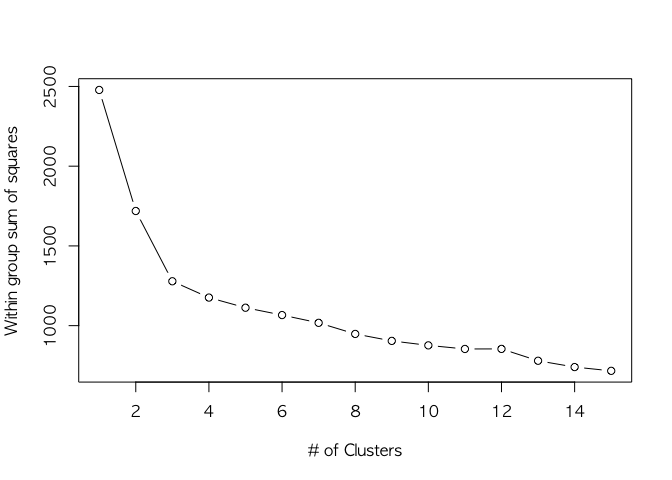
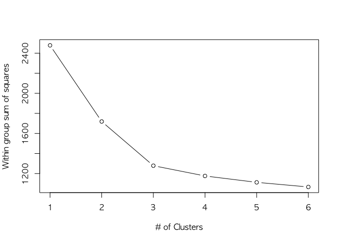
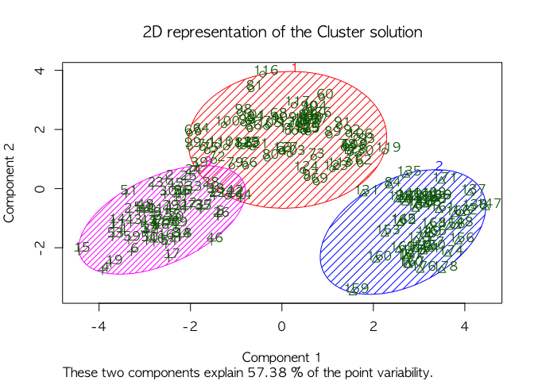
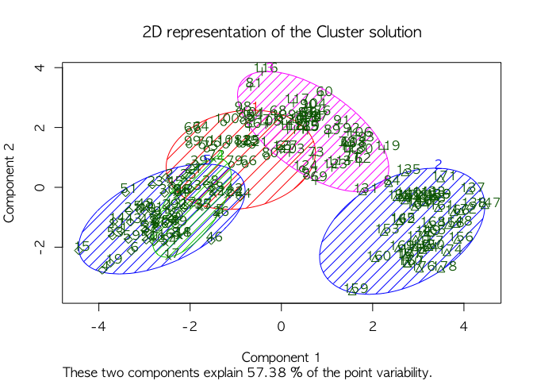
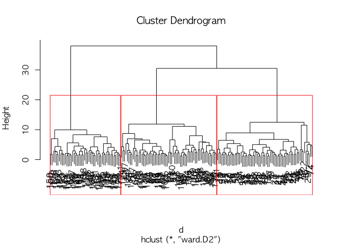

Lecture6\_Clustering.r
================

``` r
####### Clustering #######
# install.packages("NbClust")
# install.packages("cluster")
# install.packages("factoextra")
# install.packages("clValid")
# install.packages("Rcpp")

suppressMessages({
library(NbClust)
library(cluster)
library(factoextra)
library(clValid)
})
```

### 1. 최적의 k 값 찾기

: K-means알고리즘에서 최적의 **k값 (군집의 수, center값)** 찾기

<br>

#### 1-1. 데이터 불러오기 & 정리하기

``` r
#data(wine, package="rattle")
wine <- read.csv("wine.csv")
head(wine)
```

    ##   X Type Alcohol Malic  Ash Alcalinity Magnesium Phenols Flavanoids
    ## 1 1    1   14.23  1.71 2.43       15.6       127    2.80       3.06
    ## 2 2    1   13.20  1.78 2.14       11.2       100    2.65       2.76
    ## 3 3    1   13.16  2.36 2.67       18.6       101    2.80       3.24
    ## 4 4    1   14.37  1.95 2.50       16.8       113    3.85       3.49
    ## 5 5    1   13.24  2.59 2.87       21.0       118    2.80       2.69
    ## 6 6    1   14.20  1.76 2.45       15.2       112    3.27       3.39
    ##   Nonflavanoids Proanthocyanins Color  Hue Dilution Proline
    ## 1          0.28            2.29  5.64 1.04     3.92    1065
    ## 2          0.26            1.28  4.38 1.05     3.40    1050
    ## 3          0.30            2.81  5.68 1.03     3.17    1185
    ## 4          0.24            2.18  7.80 0.86     3.45    1480
    ## 5          0.39            1.82  4.32 1.04     2.93     735
    ## 6          0.34            1.97  6.75 1.05     2.85    1450

``` r
df <- scale(wine[-1])  # 항상 scaling 해주기
```

<br>

#### 1-2. k값과 초기값(nstart) 설정하기

``` r
# k-means 기본값
k.means.fit <- kmeans(df, 3) # k=3 인 경우에 k-means
k.means.fit.5 <- kmeans(df, 5) # k=5 인 경우에 k-means
k.means.fit.3.25 <- kmeans(df, 3, nstart = 25) # 다른 초기값을 25개 셋 시도

#attributes(k.means.fit)
#k.means.fit$centers
#k.means.fit$cluster
#k.means.fit$size
```

<br> 다음은 k=3 일때의 k-means알고리즘 모델 객체를 호출한 결과이다. K-평균 군집 결과를 일목요연하게 볼 수 있다.

-   **K-means clustering with 3 clusters of sizes 61, 68, 49**

: 군집의 개수(k)가 3개, 군집 1,2,3별 크기가(개체 개수) 61개, 68개, 49개

-   **Cluster means**

: 군집 1,2,3 별 변수들의 평균 좌표 (=&gt; profiling 하기에 좋다.)

-   **Clustering vector**

: 각 개체별 군집 벡터

-   **Within cluster sum of squares by cluster**

: 각 군집의 중심(centroid)와 각 군집에 속한 개체간 거리의 제곱합

-   **Available components**

: 군집분석 결과의 구성요소 =&gt; 필요한 구성요소가 있으면 이 객체(object)를 indexing해서 쓰면 요긴함

``` r
k.means.fit
```

    ## K-means clustering with 3 clusters of sizes 68, 49, 61
    ## 
    ## Cluster means:
    ##          Type    Alcohol      Malic        Ash Alcalinity   Magnesium
    ## 1  0.07973544 -0.9195318 -0.3778231 -0.4643776  0.1750133 -0.46892793
    ## 2  1.34366784  0.1860184  0.9024258  0.2485092  0.5820616 -0.05049296
    ## 3 -1.16822514  0.8756272 -0.3037196  0.3180446 -0.6626544  0.56329925
    ##       Phenols  Flavanoids Nonflavanoids Proanthocyanins      Color
    ## 1 -0.07372644  0.04416309   0.008736157      0.01821349 -0.8598525
    ## 2 -0.98577624 -1.23271740   0.714825281     -0.74749896  0.9857177
    ## 3  0.87403990  0.94098462  -0.583942581      0.58014642  0.1667181
    ##          Hue   Dilution    Proline
    ## 1  0.4233092  0.2490794 -0.7630972
    ## 2 -1.1879477 -1.2978785 -0.3789756
    ## 3  0.4823674  0.7648958  1.1550888
    ## 
    ## Clustering vector:
    ##   [1] 3 3 3 3 3 3 3 3 3 3 3 3 3 3 3 3 3 3 3 3 3 3 3 3 3 3 3 3 3 3 3 3 3 3 3
    ##  [36] 3 3 3 3 3 3 3 3 3 3 3 3 3 3 3 3 3 3 3 3 3 3 3 3 1 1 1 1 1 1 1 1 1 1 1
    ##  [71] 1 1 1 3 1 1 1 1 1 1 1 1 1 2 1 1 1 1 1 1 1 1 1 1 1 3 1 1 1 1 1 1 1 1 1
    ## [106] 1 1 1 1 1 1 1 1 1 1 1 1 1 1 1 1 1 1 1 1 1 1 1 1 1 2 2 2 2 2 2 2 2 2 2
    ## [141] 2 2 2 2 2 2 2 2 2 2 2 2 2 2 2 2 2 2 2 2 2 2 2 2 2 2 2 2 2 2 2 2 2 2 2
    ## [176] 2 2 2
    ## 
    ## Within cluster sum of squares by cluster:
    ## [1] 623.1702 304.6223 350.5475
    ##  (between_SS / total_SS =  48.4 %)
    ## 
    ## Available components:
    ## 
    ## [1] "cluster"      "centers"      "totss"        "withinss"    
    ## [5] "tot.withinss" "betweenss"    "size"         "iter"        
    ## [9] "ifault"

``` r
k.means.fit.5
```

    ## K-means clustering with 5 clusters of sizes 48, 31, 27, 56, 16
    ## 
    ## Cluster means:
    ##          Type    Alcohol      Malic        Ash Alcalinity   Magnesium
    ## 1  1.34311926  0.2024842  0.9416718  0.2625347  0.6066330 -0.03004191
    ## 2  0.07973544 -0.9607629 -0.5950300 -1.0290850 -0.1443424 -0.46298256
    ## 3  0.12752300 -0.8452219 -0.5275150 -0.3572097  0.1179630 -0.66909847
    ## 4 -1.21052889  0.9609150 -0.3300103  0.2353052 -0.8080442  0.43068729
    ## 5 -0.16218913 -0.6828651  0.3730727  0.9854713  1.0888566  0.60885258
    ##      Phenols Flavanoids Nonflavanoids Proanthocyanins      Color
    ## 1 -0.9964895 -1.2281714     0.6898521      -0.7506634  1.0027316
    ## 2  0.2588226  0.2716856    -0.4892291       0.4538172 -0.8520031
    ## 3 -0.6970085 -0.5150427     0.7320738      -0.7411997 -0.8294511
    ## 4  0.8903222  0.9750575    -0.6117927       0.5381758  0.2350641
    ## 5  0.5480739  0.6145567    -0.2157751       0.7398787 -0.7804645
    ##          Hue   Dilution    Proline
    ## 1 -1.1937885 -1.2925907 -0.3804607
    ## 2  0.5502713  0.4914993 -0.8008180
    ## 3  0.4285659 -0.2991958 -0.6705224
    ## 4  0.4564709  0.7647391  1.2285909
    ## 5  0.1943617  0.7537983 -0.4755945
    ## 
    ## Clustering vector:
    ##   [1] 4 4 4 4 5 4 4 4 4 4 4 4 4 4 4 4 4 4 4 4 4 5 4 4 4 5 4 4 4 4 4 4 4 4 4
    ##  [36] 4 4 4 4 4 4 4 4 4 4 4 4 4 4 4 4 4 4 4 4 4 4 4 4 3 3 3 3 2 3 2 2 2 3 2
    ##  [71] 3 5 3 5 2 3 2 3 2 5 2 2 3 1 2 2 3 3 3 3 3 3 3 2 2 5 5 2 2 2 2 3 5 2 2
    ## [106] 3 2 3 2 5 2 2 3 3 3 2 2 2 3 2 5 5 5 5 5 2 2 5 2 3 1 1 1 1 3 1 1 1 1 1
    ## [141] 1 1 1 1 1 1 1 1 1 1 1 1 1 1 1 1 1 1 1 1 1 1 1 1 1 1 1 1 1 1 1 1 1 1 1
    ## [176] 1 1 1
    ## 
    ## Within cluster sum of squares by cluster:
    ## [1] 294.8538 203.3838 179.9150 259.7093 175.3326
    ##  (between_SS / total_SS =  55.1 %)
    ## 
    ## Available components:
    ## 
    ## [1] "cluster"      "centers"      "totss"        "withinss"    
    ## [5] "tot.withinss" "betweenss"    "size"         "iter"        
    ## [9] "ifault"

``` r
k.means.fit.3.25
```

    ## K-means clustering with 3 clusters of sizes 61, 49, 68
    ## 
    ## Cluster means:
    ##          Type    Alcohol      Malic        Ash Alcalinity   Magnesium
    ## 1 -1.16822514  0.8756272 -0.3037196  0.3180446 -0.6626544  0.56329925
    ## 2  1.34366784  0.1860184  0.9024258  0.2485092  0.5820616 -0.05049296
    ## 3  0.07973544 -0.9195318 -0.3778231 -0.4643776  0.1750133 -0.46892793
    ##       Phenols  Flavanoids Nonflavanoids Proanthocyanins      Color
    ## 1  0.87403990  0.94098462  -0.583942581      0.58014642  0.1667181
    ## 2 -0.98577624 -1.23271740   0.714825281     -0.74749896  0.9857177
    ## 3 -0.07372644  0.04416309   0.008736157      0.01821349 -0.8598525
    ##          Hue   Dilution    Proline
    ## 1  0.4823674  0.7648958  1.1550888
    ## 2 -1.1879477 -1.2978785 -0.3789756
    ## 3  0.4233092  0.2490794 -0.7630972
    ## 
    ## Clustering vector:
    ##   [1] 1 1 1 1 1 1 1 1 1 1 1 1 1 1 1 1 1 1 1 1 1 1 1 1 1 1 1 1 1 1 1 1 1 1 1
    ##  [36] 1 1 1 1 1 1 1 1 1 1 1 1 1 1 1 1 1 1 1 1 1 1 1 1 3 3 3 3 3 3 3 3 3 3 3
    ##  [71] 3 3 3 1 3 3 3 3 3 3 3 3 3 2 3 3 3 3 3 3 3 3 3 3 3 1 3 3 3 3 3 3 3 3 3
    ## [106] 3 3 3 3 3 3 3 3 3 3 3 3 3 3 3 3 3 3 3 3 3 3 3 3 3 2 2 2 2 2 2 2 2 2 2
    ## [141] 2 2 2 2 2 2 2 2 2 2 2 2 2 2 2 2 2 2 2 2 2 2 2 2 2 2 2 2 2 2 2 2 2 2 2
    ## [176] 2 2 2
    ## 
    ## Within cluster sum of squares by cluster:
    ## [1] 350.5475 304.6223 623.1702
    ##  (between_SS / total_SS =  48.4 %)
    ## 
    ## Available components:
    ## 
    ## [1] "cluster"      "centers"      "totss"        "withinss"    
    ## [5] "tot.withinss" "betweenss"    "size"         "iter"        
    ## [9] "ifault"

<br>

#### 1-3. Elbow method로 적절한 k 값 찾기

``` r
wssplot <- function(data, nc=15, seed=1234){
  wss <- (nrow(data)-1)*sum(apply(data,2,var))
  for (i in 2:nc){
    set.seed(seed)
    wss[i] <- sum(kmeans(data, centers=i)$withinss)}
  plot(1:nc, wss, type="b", xlab="# of Clusters",
       ylab="Within group sum of squares")}

wssplot(df)
```



``` r
wssplot(df, nc = 6)
```

 
결과 그래프에서 k=3이 적정하다고 나온다.

<br>

#### 2-1. 2차원 평면에 k-means 결과값 도식화

``` r
clusplot(df, k.means.fit$cluster, main='2D representation of the Cluster solution',
         color=TRUE, shade=TRUE,
         labels=2, lines=0)
```



``` r
clusplot(df, k.means.fit.5$cluster, main='2D representation of the Cluster solution',
         color=TRUE, shade=TRUE,
         labels=2, lines=0)
```

 
k=3으로 설정했을 때보다 그래프에서 겹치는 부분이 많다.

``` r
# confusion matrix
table(wine[,2],k.means.fit$cluster)
```

    ##    
    ##      1  2  3
    ##   1  0  0 59
    ##   2 68  1  2
    ##   3  0 48  0

``` r
table(wine[,2],k.means.fit.5$cluster)
```

    ##    
    ##      1  2  3  4  5
    ##   1  0  0  0 56  3
    ##   2  1 31 26  0 13
    ##   3 47  0  1  0  0

<br>

#### 2-2. Hierarchical clustering 으로 접근

``` r
d <- dist(df, method = "euclidean") # Euclidean계산법으로 거리행렬 구하기 
H.fit <- hclust(d, method = "ward.D2") # Ward.D2는 within-cluster variance를 최소화
                                       # hclust의 첫번째 인자는 요소간의 거리행렬이어야 함 

plot(H.fit) # dendogram 도식화
groups <- cutree(H.fit, k = 3) # cutree거리(h)나 군집 수(k) 기준으로 그룹화한 결과 데이터 얻기
rect.hclust(H.fit, k = 3, border = "red") # 군집의 수(k)가 3이 되도록 군집화된 결과 나누기 
```



``` r
# Confusion matrix
table(wine[,2],groups)
```

    ##    groups
    ##      1  2  3
    ##   1 59  0  0
    ##   2  6 65  0
    ##   3  0  0 48
