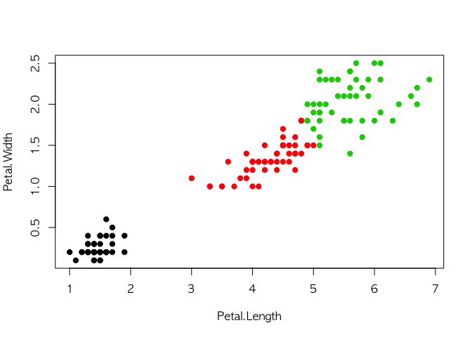

Lecture6\_Clustering.r
================

``` r
####### Clustering #######
# install.packages("NbClust")
# install.packages("cluster")
# install.packages("factoextra")
# install.packages("clValid")
# install.packages("Rcpp")

suppressMessages({
library(NbClust)
library(cluster)
library(factoextra)
library(clValid)
})
```

### 1. 최적의 k 값 찾기

: K-means알고리즘에서 최적의 **k값 (군집의 수, center값)** 찾기

<br>

#### 1-1. 데이터 불러오기 & 정리하기

``` r
#data(wine, package="rattle")
wine <- read.csv("wine.csv")
head(wine)
```

    ##   X Type Alcohol Malic  Ash Alcalinity Magnesium Phenols Flavanoids
    ## 1 1    1   14.23  1.71 2.43       15.6       127    2.80       3.06
    ## 2 2    1   13.20  1.78 2.14       11.2       100    2.65       2.76
    ## 3 3    1   13.16  2.36 2.67       18.6       101    2.80       3.24
    ## 4 4    1   14.37  1.95 2.50       16.8       113    3.85       3.49
    ## 5 5    1   13.24  2.59 2.87       21.0       118    2.80       2.69
    ## 6 6    1   14.20  1.76 2.45       15.2       112    3.27       3.39
    ##   Nonflavanoids Proanthocyanins Color  Hue Dilution Proline
    ## 1          0.28            2.29  5.64 1.04     3.92    1065
    ## 2          0.26            1.28  4.38 1.05     3.40    1050
    ## 3          0.30            2.81  5.68 1.03     3.17    1185
    ## 4          0.24            2.18  7.80 0.86     3.45    1480
    ## 5          0.39            1.82  4.32 1.04     2.93     735
    ## 6          0.34            1.97  6.75 1.05     2.85    1450

``` r
df <- scale(wine[-1])  # 항상 scaling 해주기
```

<br>

#### 1-2. k값과 초기값(nstart) 설정하기

``` r
# k-means 기본값
k.means.fit <- kmeans(df, 3) # k=3 인 경우에 k-means
k.means.fit.5 <- kmeans(df, 5) # k=5 인 경우에 k-means
k.means.fit.3.25 <- kmeans(df, 3, nstart = 25) # 다른 초기값을 25개 셋 시도

#attributes(k.means.fit)
#k.means.fit$centers
#k.means.fit$cluster
#k.means.fit$size
```

<br> 다음은 k=3 일때의 k-means알고리즘 모델 객체를 호출한 결과이다. K-평균 군집 결과를 일목요연하게 볼 수 있다.

-   **K-means clustering with 3 clusters of sizes 61, 68, 49**

: 군집의 개수(k)가 3개, 군집 1,2,3별 크기가(개체 개수) 61개, 68개, 49개

-   **Cluster means**

: 군집 1,2,3 별 변수들의 평균 좌표 (=&gt; profiling 하기에 좋다.)

-   **Clustering vector**

: 각 개체별 군집 벡터

-   **Within cluster sum of squares by cluster**

: 각 군집의 중심(centroid)와 각 군집에 속한 개체간 거리의 제곱합

-   **Available components**

: 군집분석 결과의 구성요소 =&gt; 필요한 구성요소가 있으면 이 객체(object)를 indexing해서 쓰면 요긴함

``` r
k.means.fit
```

    ## K-means clustering with 3 clusters of sizes 68, 49, 61
    ## 
    ## Cluster means:
    ##          Type    Alcohol      Malic        Ash Alcalinity   Magnesium
    ## 1  0.07973544 -0.9195318 -0.3778231 -0.4643776  0.1750133 -0.46892793
    ## 2  1.34366784  0.1860184  0.9024258  0.2485092  0.5820616 -0.05049296
    ## 3 -1.16822514  0.8756272 -0.3037196  0.3180446 -0.6626544  0.56329925
    ##       Phenols  Flavanoids Nonflavanoids Proanthocyanins      Color
    ## 1 -0.07372644  0.04416309   0.008736157      0.01821349 -0.8598525
    ## 2 -0.98577624 -1.23271740   0.714825281     -0.74749896  0.9857177
    ## 3  0.87403990  0.94098462  -0.583942581      0.58014642  0.1667181
    ##          Hue   Dilution    Proline
    ## 1  0.4233092  0.2490794 -0.7630972
    ## 2 -1.1879477 -1.2978785 -0.3789756
    ## 3  0.4823674  0.7648958  1.1550888
    ## 
    ## Clustering vector:
    ##   [1] 3 3 3 3 3 3 3 3 3 3 3 3 3 3 3 3 3 3 3 3 3 3 3 3 3 3 3 3 3 3 3 3 3 3 3
    ##  [36] 3 3 3 3 3 3 3 3 3 3 3 3 3 3 3 3 3 3 3 3 3 3 3 3 1 1 1 1 1 1 1 1 1 1 1
    ##  [71] 1 1 1 3 1 1 1 1 1 1 1 1 1 2 1 1 1 1 1 1 1 1 1 1 1 3 1 1 1 1 1 1 1 1 1
    ## [106] 1 1 1 1 1 1 1 1 1 1 1 1 1 1 1 1 1 1 1 1 1 1 1 1 1 2 2 2 2 2 2 2 2 2 2
    ## [141] 2 2 2 2 2 2 2 2 2 2 2 2 2 2 2 2 2 2 2 2 2 2 2 2 2 2 2 2 2 2 2 2 2 2 2
    ## [176] 2 2 2
    ## 
    ## Within cluster sum of squares by cluster:
    ## [1] 623.1702 304.6223 350.5475
    ##  (between_SS / total_SS =  48.4 %)
    ## 
    ## Available components:
    ## 
    ## [1] "cluster"      "centers"      "totss"        "withinss"    
    ## [5] "tot.withinss" "betweenss"    "size"         "iter"        
    ## [9] "ifault"

``` r
k.means.fit.5
```

    ## K-means clustering with 5 clusters of sizes 24, 49, 43, 20, 42
    ## 
    ## Cluster means:
    ##          Type    Alcohol      Malic         Ash Alcalinity   Magnesium
    ## 1  0.07973544 -0.9800345 -0.2339428 -0.61911389 -0.1793978  0.06185388
    ## 2  1.34366784  0.1860184  0.9024258  0.24850925  0.5820616 -0.05049296
    ## 3  0.07973544 -0.9056973 -0.4607458 -0.50185038  0.2724030 -0.68369264
    ## 4 -1.01698924  0.5073523 -0.3789552  1.27935415  0.3338928  0.78826816
    ## 5 -1.21052889  1.0286635 -0.2669777 -0.03156515 -1.0144442  0.34816863
    ##      Phenols Flavanoids Nonflavanoids Proanthocyanins       Color
    ## 1  0.5524014  0.4641768    -0.6945355       1.0052279 -0.78585644
    ## 2 -0.9857762 -1.2327174     0.7148253      -0.7474990  0.98571769
    ## 3 -0.4745104 -0.2740010     0.4018095      -0.4863046 -0.93842255
    ## 4  0.7651783  0.8677207    -0.2519332       0.2176976 -0.07293746
    ## 5  0.9558520  1.0402509    -0.7284936       0.6918839  0.29455492
    ##          Hue    Dilution    Proline
    ## 1  0.3538668  0.47181097 -0.6063207
    ## 2 -1.1879477 -1.29787850 -0.3789756
    ## 3  0.4543561  0.07787619 -0.8086104
    ## 4  0.7811582  0.74411511  0.7846963
    ## 5  0.3465752  0.81051440  1.2428052
    ## 
    ## Clustering vector:
    ##   [1] 5 5 5 5 4 5 5 4 5 5 5 5 5 5 5 4 4 4 5 5 5 4 5 4 4 4 5 5 4 5 4 5 5 4 4
    ##  [36] 4 4 4 5 5 5 5 5 5 5 5 5 5 5 5 5 5 5 4 5 5 5 5 5 3 3 3 3 1 3 1 1 3 3 1
    ##  [71] 3 4 3 4 1 3 3 3 1 1 3 1 3 2 1 3 3 3 3 3 3 3 3 1 1 1 1 1 1 1 1 3 3 3 3
    ## [106] 3 3 3 1 1 1 3 3 3 3 3 3 3 3 3 1 4 3 1 1 3 1 3 3 3 2 2 2 2 2 2 2 2 2 2
    ## [141] 2 2 2 2 2 2 2 2 2 2 2 2 2 2 2 2 2 2 2 2 2 2 2 2 2 2 2 2 2 2 2 2 2 2 2
    ## [176] 2 2 2
    ## 
    ## Within cluster sum of squares by cluster:
    ## [1] 221.1025 304.6223 287.7534 122.5262 187.0239
    ##  (between_SS / total_SS =  54.7 %)
    ## 
    ## Available components:
    ## 
    ## [1] "cluster"      "centers"      "totss"        "withinss"    
    ## [5] "tot.withinss" "betweenss"    "size"         "iter"        
    ## [9] "ifault"

``` r
k.means.fit.3.25
```

    ## K-means clustering with 3 clusters of sizes 61, 68, 49
    ## 
    ## Cluster means:
    ##          Type    Alcohol      Malic        Ash Alcalinity   Magnesium
    ## 1 -1.16822514  0.8756272 -0.3037196  0.3180446 -0.6626544  0.56329925
    ## 2  0.07973544 -0.9195318 -0.3778231 -0.4643776  0.1750133 -0.46892793
    ## 3  1.34366784  0.1860184  0.9024258  0.2485092  0.5820616 -0.05049296
    ##       Phenols  Flavanoids Nonflavanoids Proanthocyanins      Color
    ## 1  0.87403990  0.94098462  -0.583942581      0.58014642  0.1667181
    ## 2 -0.07372644  0.04416309   0.008736157      0.01821349 -0.8598525
    ## 3 -0.98577624 -1.23271740   0.714825281     -0.74749896  0.9857177
    ##          Hue   Dilution    Proline
    ## 1  0.4823674  0.7648958  1.1550888
    ## 2  0.4233092  0.2490794 -0.7630972
    ## 3 -1.1879477 -1.2978785 -0.3789756
    ## 
    ## Clustering vector:
    ##   [1] 1 1 1 1 1 1 1 1 1 1 1 1 1 1 1 1 1 1 1 1 1 1 1 1 1 1 1 1 1 1 1 1 1 1 1
    ##  [36] 1 1 1 1 1 1 1 1 1 1 1 1 1 1 1 1 1 1 1 1 1 1 1 1 2 2 2 2 2 2 2 2 2 2 2
    ##  [71] 2 2 2 1 2 2 2 2 2 2 2 2 2 3 2 2 2 2 2 2 2 2 2 2 2 1 2 2 2 2 2 2 2 2 2
    ## [106] 2 2 2 2 2 2 2 2 2 2 2 2 2 2 2 2 2 2 2 2 2 2 2 2 2 3 3 3 3 3 3 3 3 3 3
    ## [141] 3 3 3 3 3 3 3 3 3 3 3 3 3 3 3 3 3 3 3 3 3 3 3 3 3 3 3 3 3 3 3 3 3 3 3
    ## [176] 3 3 3
    ## 
    ## Within cluster sum of squares by cluster:
    ## [1] 350.5475 623.1702 304.6223
    ##  (between_SS / total_SS =  48.4 %)
    ## 
    ## Available components:
    ## 
    ## [1] "cluster"      "centers"      "totss"        "withinss"    
    ## [5] "tot.withinss" "betweenss"    "size"         "iter"        
    ## [9] "ifault"

<br>

#### 1-3. Elbow method로 적절한 k 값 찾기

``` r
wssplot <- function(data, nc=15, seed=1234){
  wss <- (nrow(data)-1)*sum(apply(data,2,var))
  for (i in 2:nc){
    set.seed(seed)
    wss[i] <- sum(kmeans(data, centers=i)$withinss)}
  plot(1:nc, wss, type="b", xlab="# of Clusters",
       ylab="Within group sum of squares")}

wssplot(df)
```


``` r
wssplot(df, nc = 6)
```

 결과 그래프에서 k=3이 적정하다고 나온다.

<br>

#### 2-1. 2차원 평면에 k-means 결과값 도식화

``` r
clusplot(df, k.means.fit$cluster, main='2D representation of the Cluster solution',
         color=TRUE, shade=TRUE,
         labels=2, lines=0)
```


``` r
clusplot(df, k.means.fit.5$cluster, main='2D representation of the Cluster solution',
         color=TRUE, shade=TRUE,
         labels=2, lines=0)
```

 k=3으로 설정했을 때보다 그래프에서 겹치는 부분이 많다.

``` r
# confusion matrix
table(wine[,2],k.means.fit$cluster)
```

    ##    
    ##      1  2  3
    ##   1  0  0 59
    ##   2 68  1  2
    ##   3  0 48  0

``` r
table(wine[,2],k.means.fit.5$cluster)
```

    ##    
    ##      1  2  3  4  5
    ##   1  0  0  0 17 42
    ##   2 24  1 43  3  0
    ##   3  0 48  0  0  0

<br>

#### 2-2. Hierarchical clustering 으로 접근

``` r
d <- dist(df, method = "euclidean") # Euclidean계산법으로 거리행렬 구하기 
H.fit <- hclust(d, method = "ward.D2") # Ward.D2는 within-cluster variance를 최소화
                                       # hclust의 첫번째 인자는 요소간의 거리행렬이어야 함 

plot(H.fit) # dendogram 도식화
groups <- cutree(H.fit, k = 3) # cutree거리(h)나 군집 수(k) 기준으로 그룹화한 결과 데이터 얻기
rect.hclust(H.fit, k = 3, border = "red") # 군집의 수(k)가 3이 되도록 군집화된 결과 나누기 
```


``` r
# Confusion matrix
table(wine[,2],groups)
```

    ##    groups
    ##      1  2  3
    ##   1 59  0  0
    ##   2  6 65  0
    ##   3  0  0 48

<br>

k-means 그룹간 거리 측정하기
----------------------------

``` r
data(ruspini)

rusp.norm <- scale(ruspini) # 항상 Feature scaling 해주고 데이터 작업
rusp.norm.euclid <- dist(rusp.norm, method = "euclidean") 

par(mfrow = c(2, 1))
cl.sin <- hclust(rusp.norm.euclid, method = "single") #bottom up
cl.ave <- hclust(rusp.norm.euclid, method = "average") # top down
```

``` r
plot(cl.sin, hang = -1)
```


``` r
plot(cl.ave, hang = -1)
```


``` r
par(mfrow = c(1, 1))

par(mar = c(5,4,1,1))
mycluster = function(data, cluster, K, ...) {
  col = cutree(cluster, k = K)
  plot(data, col = col, pch = 19, ...)
}
mycluster(ruspini, cl.sin, K = 2)
mycluster(ruspini, cl.ave, K = 2)
```


``` r
mycluster(ruspini, cl.sin, K = 3)
```


``` r
mycluster(ruspini, cl.ave, K = 3)
```


``` r
par(mfrow = c(1, 1))
```

``` r
## 3. iris 데이터로 iteration 효과 확인
library(ggplot2)
ggplot(iris, aes(Petal.Length, Petal.Width, color = Species)) + geom_point()
```


``` r
km.5 <- kmeans(iris[,3:4], centers = 3, nstart = 10,
                iter.max = 5, algorithm = "Lloyd")
```

    ## Warning: did not converge in 5 iterations

    ## Warning: did not converge in 5 iterations

    ## Warning: did not converge in 5 iterations

    ## Warning: did not converge in 5 iterations

    ## Warning: did not converge in 5 iterations

    ## Warning: did not converge in 5 iterations

    ## Warning: did not converge in 5 iterations

    ## Warning: did not converge in 5 iterations

    ## Warning: did not converge in 5 iterations

``` r
# 실행후 Warning messages : did not converge in 5 iterations 
plot(iris[,3:4], pch = 19, col = km.5$cluster)
```


``` r
km.10 <- kmeans(iris[,3:4], centers = 3, nstart = 10,
             iter.max = 10, algorithm = "Lloyd")
# iter.max(반복횟수)값을 늘려주니 converge(수렴) 함
plot(iris[,3:4], pch = 19, col = km.10$cluster)
```



``` r
km.20 <- kmeans(iris[,3:4], centers = 3, nstart = 10,
             iter.max = 20, algorithm = "Lloyd")
# 결과는 동일
plot(iris[,3:4], pch = 19, col = km.20$cluster)
```


``` r
## 4. Visualization tool 활용
## 4.1 k-medoids 의 효과 보기

fviz_nbclust(df, kmeans, method = "gap_stat") # 적정 k 값 찾기
```


``` r
k.means.fit <- kmeans(df, 3, nstart = 25) # k-means
fviz_cluster(k.means.fit, data = df, frame.type = "convex")+ theme_minimal()
```

    ## Warning: argument frame is deprecated; please use ellipse instead.

    ## Warning: argument frame.type is deprecated; please use ellipse.type
    ## instead.


``` r
pam.res <- pam(df, 3) # k-medoids
fviz_cluster(pam.res)  # 적용후 k-means 보다 덜 겹침
```


``` r
## 4.2 다른 데이터에 적용
data("USArrests")
my_data <- scale(USArrests)
d <- dist(my_data, method = "euclidean")
res.hc <- hclust(d, method = "ward.D2" ) #ward.D2s - bottom up
grp <- cutree(res.hc, k = 4)
plot(res.hc, cex = 0.6)
rect.hclust(res.hc, k = 4, border = 2:5) # Cluster dendrogram 이 4개
```


``` r
# Dendrogram (hcut 함수 이용)
res.hcut <- hcut(USArrests, k = 4, stand = TRUE)
fviz_dend(res.hcut, rect = TRUE, cex = 0.5,
          k_colors = c("#00AFBB","#2E9FDF", "#E7B800", "#FC4E07"))
```


``` r
# Optimal k 찾기
fviz_nbclust(my_data, kmeans, method = "gap_stat")
```


``` r
res.nbclust <- NbClust(my_data, distance = "euclidean",
                       min.nc = 2, max.nc = 10, 
                       method = "complete", index ="all") 
```


    ## *** : The Hubert index is a graphical method of determining the number of clusters.
    ##                 In the plot of Hubert index, we seek a significant knee that corresponds to a 
    ##                 significant increase of the value of the measure i.e the significant peak in Hubert
    ##                 index second differences plot. 
    ## 


    ## *** : The D index is a graphical method of determining the number of clusters. 
    ##                 In the plot of D index, we seek a significant knee (the significant peak in Dindex
    ##                 second differences plot) that corresponds to a significant increase of the value of
    ##                 the measure. 
    ##  
    ## ******************************************************************* 
    ## * Among all indices:                                                
    ## * 9 proposed 2 as the best number of clusters 
    ## * 4 proposed 3 as the best number of clusters 
    ## * 6 proposed 4 as the best number of clusters 
    ## * 2 proposed 5 as the best number of clusters 
    ## * 1 proposed 8 as the best number of clusters 
    ## * 1 proposed 10 as the best number of clusters 
    ## 
    ##                    ***** Conclusion *****                            
    ##  
    ## * According to the majority rule, the best number of clusters is  2 
    ##  
    ##  
    ## *******************************************************************

``` r
factoextra::fviz_nbclust(res.nbclust) + theme_minimal()
```

    ## Among all indices: 
    ## ===================
    ## * 2 proposed  0 as the best number of clusters
    ## * 1 proposed  1 as the best number of clusters
    ## * 9 proposed  2 as the best number of clusters
    ## * 4 proposed  3 as the best number of clusters
    ## * 6 proposed  4 as the best number of clusters
    ## * 2 proposed  5 as the best number of clusters
    ## * 1 proposed  8 as the best number of clusters
    ## * 1 proposed  10 as the best number of clusters
    ## 
    ## Conclusion
    ## =========================
    ## * According to the majority rule, the best number of clusters is  2 .


``` r
## 5. 무슨 방법을 적용하는게 가장 좋은지 테스트

test.result <- clValid(my_data, nClust = 2:6, 
                  clMethods = c("hierarchical","kmeans","pam"),  # k-medoid~
                  validation = "internal")
summary(test.result)
```

    ## 
    ## Clustering Methods:
    ##  hierarchical kmeans pam 
    ## 
    ## Cluster sizes:
    ##  2 3 4 5 6 
    ## 
    ## Validation Measures:
    ##                                  2       3       4       5       6
    ##                                                                   
    ## hierarchical Connectivity   6.6437  9.5615 13.9563 22.5782 31.2873
    ##              Dunn           0.2214  0.2214  0.2224  0.2046  0.2126
    ##              Silhouette     0.4085  0.3486  0.3637  0.3213  0.2720
    ## kmeans       Connectivity   6.6437 13.6484 16.2413 24.6639 33.7194
    ##              Dunn           0.2214  0.2224  0.2224  0.1983  0.2231
    ##              Silhouette     0.4085  0.3668  0.3573  0.3377  0.3079
    ## pam          Connectivity   6.6437 13.8302 20.4421 29.5726 38.2643
    ##              Dunn           0.2214  0.1376  0.1849  0.1849  0.2019
    ##              Silhouette     0.4085  0.3144  0.3390  0.3105  0.2630
    ## 
    ## Optimal Scores:
    ## 
    ##              Score  Method       Clusters
    ## Connectivity 6.6437 hierarchical 2       
    ## Dunn         0.2231 kmeans       6       
    ## Silhouette   0.4085 hierarchical 2
