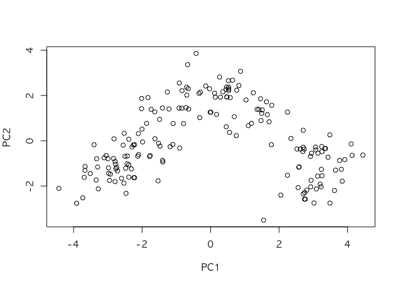

Dimensionality reduction\_PCA
================

``` r
# install.packages("stats")
# install.packages("caret")
# install.packages("contrib.url")
library(stats)
library(caret)
```

    ## Loading required package: lattice

### Principle Component Analysis (PCA)

<br>

#### 1. PCA 작동 원리

``` r
# 정규 분포 데이터 시뮬레이션
set.seed(111)
mat <- scale(matrix(rnorm(20), 4, 5))
dimnames(mat) <- list(paste("Sample", 1:4), paste("Var", 1:5))

# PCA 적용
myPCA <- prcomp(mat, scale. = F, center = F)
myPCA$rotation # loadings
```

    ##              PC1        PC2         PC3        PC4
    ## Var 1  0.5655745  0.2649776 -0.07152795 -0.7760668
    ## Var 2  0.3925850 -0.4345589 -0.78303707  0.2087883
    ## Var 3 -0.4308613  0.4594848 -0.49793692 -0.1485338
    ## Var 4  0.5687865  0.2267003  0.28633147  0.4266891
    ## Var 5 -0.1297802 -0.6916835  0.22761768 -0.3873008

``` r
myPCA$x # scores
```

    ##                 PC1        PC2        PC3           PC4
    ## Sample 1  1.8352910 -0.6882701  0.5157173 -2.498002e-16
    ## Sample 2  0.5828628 -0.3011840 -0.8547381  6.487866e-16
    ## Sample 3 -0.3602229  2.0468495  0.1468951 -2.220446e-16
    ## Sample 4 -2.0579309 -1.0573955  0.1921257 -1.110223e-16

``` r
# SVD 찾기
(mySVD <- svd(mat))
```

    ## $d
    ## [1] 2.841278e+00 2.423243e+00 1.027148e+00 3.771821e-16
    ## 
    ## $u
    ##            [,1]       [,2]       [,3] [,4]
    ## [1,]  0.6459385 -0.2840285  0.5020869  0.5
    ## [2,]  0.2051410 -0.1242896 -0.8321474  0.5
    ## [3,] -0.1267820  0.8446737  0.1430127  0.5
    ## [4,] -0.7242975 -0.4363556  0.1870478  0.5
    ## 
    ## $v
    ##            [,1]       [,2]        [,3]       [,4]
    ## [1,]  0.5655745  0.2649776 -0.07152795 -0.7760668
    ## [2,]  0.3925850 -0.4345589 -0.78303707  0.2087883
    ## [3,] -0.4308613  0.4594848 -0.49793692 -0.1485338
    ## [4,]  0.5687865  0.2267003  0.28633147  0.4266891
    ## [5,] -0.1297802 -0.6916835  0.22761768 -0.3873008

``` r
sigma <- matrix(0,4,4) # 4 x 5 행렬이니까 최대 4개의 PC가 나온다. 5번째는 버림
diag(sigma) <- mySVD$d


theoreticalScores <- mySVD$u %*% sigma
all(round(myPCA$x,5) == round(theoreticalScores,5)) # 이론값과 같다는 증명
```

    ## [1] TRUE

``` r
all(round(myPCA$rotation,5) == round(mySVD$v,5)) # Eigenvector와의 비교값
```

    ## [1] TRUE

``` r
recoverMatSVD <- theoreticalScores %*% t(mySVD$v)
all(round(mat,5) == round(recoverMatSVD,5)) # mat이 위에 구한값과 같다는 것을 증명
```

    ## [1] TRUE

``` r
recoverMatPCA <- myPCA$x %*% t(myPCA$rotation)
all(round(mat,5) == round(recoverMatPCA,5)) # mat이 scores*t(loadings)와 같다는 것을 증명
```

    ## [1] TRUE

``` r
## 2. Wine 데이터에 PCA 적용
# data(wine, package="rattle")
wine <- read.csv("wine.csv")
df <- scale(wine[-1]) # 맨앞 Type열을 뺀 전부

names(df) <- c("Type", "Alcohol", "Malic acid", "Ash", "Alcalinity of ash", 
                 "Magnesium", "Total phenols", "Flavanoids", "Nonflavanoid phenols", 
                 "Proanthocyanins", "Color intensity", "Hue", "OD280/OD315 of diluted wines", 
                 "Proline")

wine_pca <- prcomp(df, center = TRUE, scale = TRUE) # prcomp가 PCA 작업하는 명령어

plot(wine_pca$x[,1:2])
```



``` r
plot(wine_pca$x[,3:4])
```


``` r
#wine_pca$x # PC 값 확
#wine_pca$sdev # eigenvalue 값
#length(wine_pca$sdev)
#wine_pca$rotation
#dim(wine_pca$rotation)
#wine_pca$x
#dim(wine_pca$x)
```

``` r
summary(wine_pca)
```

    ## Importance of components%s:
    ##                           PC1    PC2    PC3     PC4     PC5     PC6
    ## Standard deviation     2.3529 1.5802 1.2025 0.96328 0.93675 0.82023
    ## Proportion of Variance 0.3954 0.1784 0.1033 0.06628 0.06268 0.04806
    ## Cumulative Proportion  0.3954 0.5738 0.6771 0.74336 0.80604 0.85409
    ##                            PC7    PC8     PC9    PC10    PC11    PC12
    ## Standard deviation     0.74418 0.5916 0.54272 0.51216 0.47524 0.41085
    ## Proportion of Variance 0.03956 0.0250 0.02104 0.01874 0.01613 0.01206
    ## Cumulative Proportion  0.89365 0.9186 0.93969 0.95843 0.97456 0.98662
    ##                           PC13    PC14
    ## Standard deviation     0.35995 0.24044
    ## Proportion of Variance 0.00925 0.00413
    ## Cumulative Proportion  0.99587 1.00000

``` r
par(mfcol=c(1,1))
plot(cumsum(wine_pca$sdev^2/sum(wine_pca$sdev^2)))
```


``` r
# 그래프로 표현하기
biplot(wine_pca) 
```


``` r
plot(cumsum(wine_pca$sdev^2/sum(wine_pca$sdev^2))) 
```


``` r
wine[c(4, 19),] 
```

    ##     X Type Alcohol Malic  Ash Alcalinity Magnesium Phenols Flavanoids
    ## 4   4    1   14.37  1.95 2.50       16.8       113    3.85       3.49
    ## 19 19    1   14.19  1.59 2.48       16.5       108    3.30       3.93
    ##    Nonflavanoids Proanthocyanins Color  Hue Dilution Proline
    ## 4           0.24            2.18   7.8 0.86     3.45    1480
    ## 19          0.32            1.86   8.7 1.23     2.82    1680

``` r
biplot(wine_pca, xlabs = rep("", nrow(wine)))
```

 

#### 3. USArret 데이터에 활용

``` r
# 3.1 princomp 명령어
pca2 <- princomp(USArrests, cor = TRUE)
pca2$sdev
```

    ##    Comp.1    Comp.2    Comp.3    Comp.4 
    ## 1.5748783 0.9948694 0.5971291 0.4164494

``` r
unclass(pca2$loadings)
```

    ##              Comp.1     Comp.2     Comp.3      Comp.4
    ## Murder   -0.5358995  0.4181809 -0.3412327  0.64922780
    ## Assault  -0.5831836  0.1879856 -0.2681484 -0.74340748
    ## UrbanPop -0.2781909 -0.8728062 -0.3780158  0.13387773
    ## Rape     -0.5434321 -0.1673186  0.8177779  0.08902432

``` r
head(pca2$scores)
```

    ##                Comp.1     Comp.2      Comp.3       Comp.4
    ## Alabama    -0.9855659  1.1333924 -0.44426879  0.156267145
    ## Alaska     -1.9501378  1.0732133  2.04000333 -0.438583440
    ## Arizona    -1.7631635 -0.7459568  0.05478082 -0.834652924
    ## Arkansas    0.1414203  1.1197968  0.11457369 -0.182810896
    ## California -2.5239801 -1.5429340  0.59855680 -0.341996478
    ## Colorado   -1.5145629 -0.9875551  1.09500699  0.001464887

3.2 PCA 명령어 활용
===================

``` r
#install.packages("FactoMineR")
library(FactoMineR)

pca3 <- PCA(USArrests, graph = TRUE)
```


``` r
pca3$eig # eigenvector 값 보기
```

    ##        eigenvalue percentage of variance cumulative percentage of variance
    ## comp 1  2.4802416              62.006039                          62.00604
    ## comp 2  0.9897652              24.744129                          86.75017
    ## comp 3  0.3565632               8.914080                          95.66425
    ## comp 4  0.1734301               4.335752                         100.00000

``` r
pca3$var$coord # 변수간 correlation 보기
```

    ##              Dim.1      Dim.2      Dim.3       Dim.4
    ## Murder   0.8439764 -0.4160354  0.2037600  0.27037052
    ## Assault  0.9184432 -0.1870211  0.1601192 -0.30959159
    ## UrbanPop 0.4381168  0.8683282  0.2257242  0.05575330
    ## Rape     0.8558394  0.1664602 -0.4883190  0.03707412

``` r
head(pca3$ind$coord) # Score 보기
```

    ##                 Dim.1      Dim.2       Dim.3        Dim.4
    ## Alabama     0.9855659 -1.1333924  0.44426879  0.156267145
    ## Alaska      1.9501378 -1.0732133 -2.04000333 -0.438583440
    ## Arizona     1.7631635  0.7459568 -0.05478082 -0.834652924
    ## Arkansas   -0.1414203 -1.1197968 -0.11457369 -0.182810896
    ## California  2.5239801  1.5429340 -0.59855680 -0.341996478
    ## Colorado    1.5145629  0.9875551 -1.09500699  0.001464887

#### 4. 그래프 그리기

``` r
library(ggplot2)

scores <- as.data.frame(wine_pca$x)

ggplot(data = scores, aes(x = PC1, y = PC2, label = rownames(scores))) +
  geom_hline(yintercept = 0, colour = "gray65") +
  geom_vline(xintercept = 0, colour = "gray65") +
  geom_text(colour = "tomato", alpha = 0.8, size = 4) +
  ggtitle("미국 범죄율 PCA plot")
```

 

#### 5. 몇 개의 변수만을 골라서 작업하기

``` r
pc.use <- 7 # 90%의 covariance를 설명한다
trunc <- wine_pca$x[,1:pc.use] # %*% t(wine_pca$rotation[,1:pc.use])

dim(trunc); dim(wine)
```

    ## [1] 178   7

    ## [1] 178  15

``` r
RAN <- range(cbind(wine[-1], trunc))
BREAKS <- seq(RAN[1], RAN[2], 100)
COLS <- rainbow(length(BREAKS)-1)
par(mfcol=c(1,2), mar=c(1,1,2,1))
image(as.matrix(wine[-1]), main="Original matrix", xlab="", ylab="", xaxt="n", yaxt="n", breaks=BREAKS, col=COLS)
# box()
image(trunc, main="Truncated matrix (7 PCs)", xlab="", ylab="", xaxt="n", yaxt="n", breaks=BREAKS, col=COLS)
```


``` r
# box()
par(mfcol=c(1,1))
```

### PCA Appendix. k-means에서 몇 개의 Cluster가 최적 갯수일까?

``` r
# PCA-weighted k-means 
source("https://raw.github.com/talgalili/R-code-snippets/master/clustergram.r")

data(iris)
set.seed(250)
par(cex.lab = 1.5, cex.main = 1.2)
Data <- scale(iris[,-5])
clustergram(Data, k.range = 2:8, line.width = 0.004)
```

    ## Loading required package: colorspace

    ## Loading required package: plyr


``` r
par(cex.lab = 1.2, cex.main = .7)
par(mfrow = c(3,2))
for(i in 1:6) clustergram(Data, k.range = 2:8 , line.width = .004, add.center.points = T)
```


