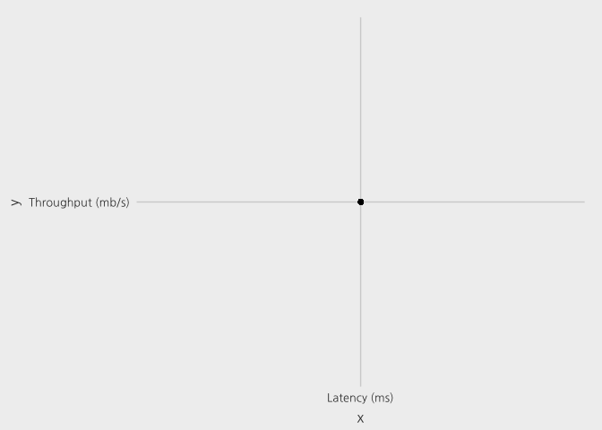

Anomaly detection
================

참고: <http://datascience-enthusiast.com/R/anomaly_detection_R.html>

``` r
# install.packages("magrittr")
# install.packages("ggplot2")
# install.packages("MASS")
# install.packages("caret")
# install.packages("reshape2")

suppressMessages({
library(magrittr)  
library(ggplot2)   
library(MASS)      
library(caret)     
library(reshape2)
})
```

1. 변수가 1개 일때
------------------

``` r
load("data1.RData")
X <- data.frame(data1$X)
Xval <- data.frame(data1$Xval)
yval <- data.frame(data1$yval)

names(X) <- c("Latency (ms)", "Throughput (mb/s)")
XX <- melt(X)
```

    ## No id variables; using all as measure variables

``` r
names(Xval) <- c("Latency (ms)", "Throughput (mb/s)")
XXval <- melt(Xval)
```

    ## No id variables; using all as measure variables

``` r
XX%>%ggplot(aes(x=value,fill=variable, color=variable))+
  geom_density(alpha = 0.3)+ggtitle('훈련 데이터 분포')
```


``` r
XXval%>%ggplot(aes(x=value,fill=variable, color=variable))+
  geom_density(alpha = 0.3)+ggtitle('Validation 데이터 분포')
```


``` r
X%>%ggplot(aes(x=`Latency (ms)`,y=`Throughput (mb/s)`))+
  geom_point(color='blue')
```


``` r
preObj <- preProcess(X, method="center")

X2 <- predict(preObj,X)

X2 <- as.matrix(X2)
(sigma2 <- diag(var(X2)))
```

    ##      Latency (ms) Throughput (mb/s) 
    ##          1.838620          1.715333

``` r
(sigma2 <- diag(sigma2))
```

    ##         [,1]     [,2]
    ## [1,] 1.83862 0.000000
    ## [2,] 0.00000 1.715333

``` r
A <-(2*pi)^(-ncol(X2)/2)*det(sigma2)^(-0.5)

B <- exp(-0.5 *rowSums((X2%*%ginv(sigma2))*X2))
p <- A*B

p <- p%>%as.data.frame()
names(p) <- c('probability')
p%>%ggplot(aes(probability))+geom_density(fill='skyblue')+
  ggtitle('계산된 확률의 분포')
```


``` r
p%>%ggplot(aes(y=probability,x=1))+geom_boxplot()+
  geom_jitter()+xlab('')+ggtitle('계산된 확률의 Boxplot')
```


``` r
X <- cbind(X,p) # Contour 그래프
ggplot(X, aes(x='Latency (ms)', y='Throughput (mb/s)', z='probability'))+ 
  geom_point()+ stat_density2d(color='red')
```

    ## Warning: Computation failed in `stat_density2d()`:
    ## bandwidths must be strictly positive



``` r
Xval <- as.data.frame(Xval)
preObj <- preProcess(Xval,method="center")

Xval_centered <- predict(preObj,Xval)

# Centering 된 값으로 Variance 계산
Xval_centered <- as.matrix(Xval_centered)
sigma2 <- diag(var(Xval_centered))
(sigma2 <- diag(sigma2))
```

    ##          [,1]     [,2]
    ## [1,] 2.526098 0.000000
    ## [2,] 0.000000 1.631331

``` r
A <-(2*pi)^(-ncol(Xval_centered)/2)*det(sigma2)^(-0.5)

B <- exp(-0.5 *rowSums((Xval_centered%*%ginv(sigma2))*Xval_centered))
pval <- A*B # p-value 계산


# F1 score 계산
bestEpsilon <- 0 ; bestF1 <- 0; F1 <- 0

stepsize = (max(pval) - min(pval)) / 1000

for (epsilon in seq(from =min(pval), by= stepsize,to =max(pval))){
  
  predictions = (pval < epsilon)*1
  
  tp = sum((predictions == 1) & (yval == 1))
  fp = sum((predictions == 1) & (yval == 0))
  fn = sum((predictions == 0) & (yval == 1))
  prec = tp / (tp + fp)
  rec = tp / (tp + fn)
  F1 = (2 * prec * rec) / (prec + rec)
  
  if (!is.na(F1)& (F1 > bestF1)==TRUE){
    bestF1 = F1
    bestEpsilon = epsilon
    
  }
}

cat("\n bestF1 =",round(bestF1,4))
```

    ## 
    ##  bestF1 = 0.875

``` r
cat("\n bestEpsilon =",round(bestEpsilon,4))
```

    ## 
    ##  bestEpsilon = 2e-04

``` r
X$outliers <- X$probability < bestEpsilon
X$outliers <- as.factor(X$outliers)
head(X)
```

    ##   Latency (ms) Throughput (mb/s) probability outliers
    ## 1     13.04682          14.74115  0.06456665    FALSE
    ## 2     13.40852          13.76327  0.05023525    FALSE
    ## 3     14.19591          15.85318  0.07226516    FALSE
    ## 4     14.91470          16.17426  0.05024677    FALSE
    ## 5     13.57670          14.04285  0.06354887    FALSE
    ## 6     13.92240          13.40647  0.04242358    FALSE

``` r
table(X$outliers)
```

    ## 
    ## FALSE  TRUE 
    ##   301     6

``` r
X%>%ggplot(aes(x=`Latency (ms)`,y=`Throughput (mb/s)`))+
  geom_point(aes(color=outliers))+ggtitle('Anomaly Detection')
```


``` r
## 2. 다변수인 경우
load("data2.RData")

X <- data2$X       
Xval <- data2$Xval
yval <- data2$yval

X%>%as.data.frame()%>%melt()%>%
  ggplot(aes(x=value,color=variable))+geom_density()
```

    ## No id variables; using all as measure variables


``` r
cat("Number of variables and observations (훈련 데이터)")
```

    ## Number of variables and observations (훈련 데이터)

``` r
dim(X)
```

    ## [1] 1000   11

``` r
cat("Number of variables and observations (Validation 데이터)")
```

    ## Number of variables and observations (Validation 데이터)

``` r
dim(Xval)
```

    ## [1] 100  11

``` r
cat("Validation 데이터 Label")
```

    ## Validation 데이터 Label

``` r
cat("y=0 는 정상, y=1는 비정상")
```

    ## y=0 는 정상, y=1는 비정상

``` r
dim(yval)
```

    ## [1] 100   1

``` r
Xval%>%as.data.frame()%>%melt()%>%
  ggplot(aes(x=value,color=variable))+geom_density()
```

    ## No id variables; using all as measure variables


``` r
X <- as.data.frame(X)
preObj <- preProcess(X,method="center")

X2 <- predict(preObj,X)

sigma2 <- cov(X2)
sigma2.diag <- diag(sigma2)

X2 <- as.matrix(X2)
A <- (2*pi)^(-ncol(X2)/2)*det(sigma2)^(-0.5)

B <- exp(-0.5 *rowSums((X2%*%ginv(sigma2))*X2))
p <- A*B

Xval <- as.data.frame(Xval)
preObj <- preProcess(Xval,method="center")

Xval_centered <- predict(preObj,Xval)

Xval_centered <- as.matrix(Xval_centered)
sigma2.val <- var(Xval_centered)
sigma2.val.diag <- diag(sigma2.val)

A <- (2*pi)^(-ncol(Xval_centered)/2)*det(sigma2.val)^(-0.5)

B <- exp(-0.5 *rowSums((Xval_centered%*%ginv(sigma2.val))*Xval_centered))
pval <- A*B

# F1-score 계산
bestEpsilon <- 0 ; bestF1 <- 0; F1 <- 0

stepsize <- (max(pval) - min(pval)) / 1000

for (epsilon in seq(from =min(pval), by= stepsize,to =max(pval))){
  
  predictions = (pval < epsilon)*1
  
  tp = sum((predictions == 1) & (yval == 1))
  fp = sum((predictions == 1) & (yval == 0))
  fn = sum((predictions == 0) & (yval == 1))
  prec = tp / (tp + fp)
  rec = tp / (tp + fn)
  F1 = (2 * prec * rec) / (prec + rec)
  
  if (!is.na(F1)& (F1 > bestF1)==TRUE){
    bestF1 = F1
    bestEpsilon = epsilon
    
  }
}

cat("\n bestF1 =",bestF1)
```

    ## 
    ##  bestF1 = 0.6666667

``` r
cat("\n bestEpsilon =",bestEpsilon)
```

    ## 
    ##  bestEpsilon = 7.755133e-19

``` r
probability <- p
X <- cbind(X,probability)
X$outliers <- X$probability < bestEpsilon
X$outliers <- as.factor(X$outliers)

table(X$outliers)
```

    ## 
    ## FALSE  TRUE 
    ##   917    83
