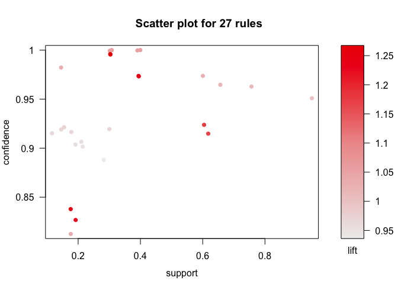
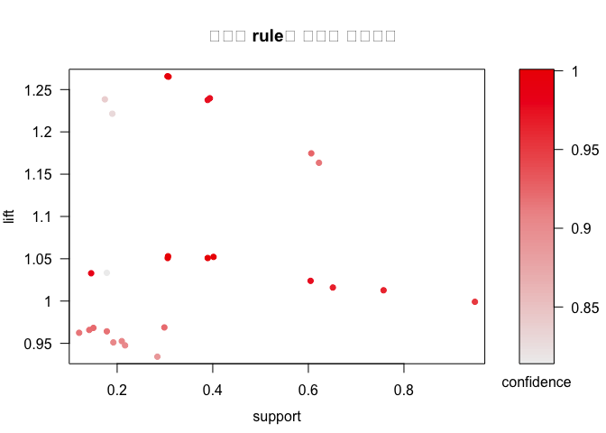
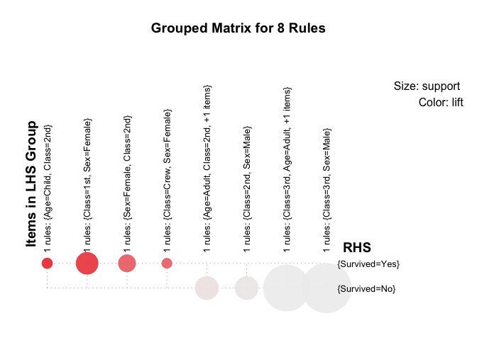
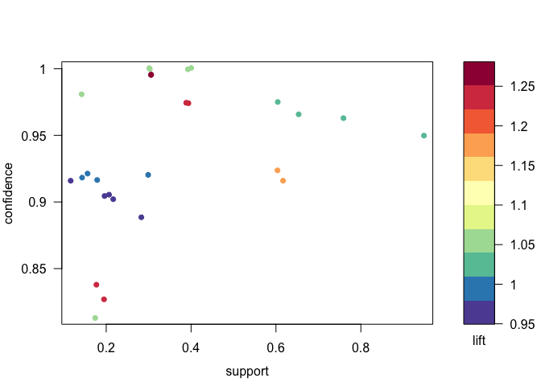
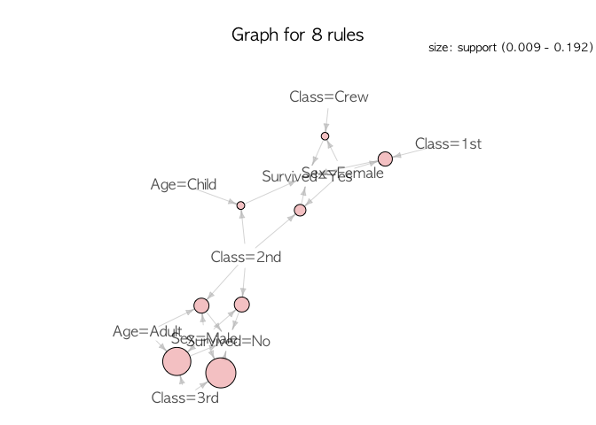

Association rule - No sequence
================

``` r
# Association rules: apriori(), eclat() - package arules
# Sequential patterns: arulesSequence
# Visualization of associations: arulesViz

# install.packages("arules")
# install.packages("arulesSequences")
# install.packages("arulesViz")
library(arulesSequences)
```

    ## Loading required package: arules

    ## Loading required package: Matrix

    ## 
    ## Attaching package: 'arules'

    ## The following objects are masked from 'package:base':
    ## 
    ##     abbreviate, write

``` r
library(arulesViz)
```

    ## Loading required package: grid

<br>

### 1. Load data

``` r
# 데이터 불러오기
load("titanic.raw.rdata")
dim(titanic.raw)
```

    ## [1] 2201    4

``` r
summary(titanic.raw)
```

    ##   Class         Sex          Age       Survived  
    ##  1st :325   Female: 470   Adult:2092   No :1490  
    ##  2nd :285   Male  :1731   Child: 109   Yes: 711  
    ##  3rd :706                                        
    ##  Crew:885

``` r
# 데이터 제대로 불러왔는지 확인
index <- sample(1:nrow(titanic.raw), 8)
titanic.raw[index,]
```

    ##      Class  Sex   Age Survived
    ## 1091  Crew Male Adult       No
    ## 912   Crew Male Adult       No
    ## 1215  Crew Male Adult       No
    ## 232    2nd Male Adult       No
    ## 575    3rd Male Adult       No
    ## 1100  Crew Male Adult       No
    ## 552    3rd Male Adult       No
    ## 1627   3rd Male Adult      Yes

<br>

### 2. Finding Association Rule using Apriori Algorithm

> #### Apriori Algorithm
>
> -   가장 자주 등장하는 조합을 찾는 알고리즘
> -   k-1 item frequent set을 사용하여 k item frequent set 생성
> -   전 단계에서 버려진(prune된) item을 포함하는 조합은 고려하지 않기 때문에 계산속도가 빠름

``` r
library(arules) # apriori 함수용 패키지

rules.all <- apriori(titanic.raw)
```

    ## Apriori
    ## 
    ## Parameter specification:
    ##  confidence minval smax arem  aval originalSupport maxtime support minlen
    ##         0.8    0.1    1 none FALSE            TRUE       5     0.1      1
    ##  maxlen target   ext
    ##      10  rules FALSE
    ## 
    ## Algorithmic control:
    ##  filter tree heap memopt load sort verbose
    ##     0.1 TRUE TRUE  FALSE TRUE    2    TRUE
    ## 
    ## Absolute minimum support count: 220 
    ## 
    ## set item appearances ...[0 item(s)] done [0.00s].
    ## set transactions ...[10 item(s), 2201 transaction(s)] done [0.00s].
    ## sorting and recoding items ... [9 item(s)] done [0.00s].
    ## creating transaction tree ... done [0.00s].
    ## checking subsets of size 1 2 3 4 done [0.00s].
    ## writing ... [27 rule(s)] done [0.00s].
    ## creating S4 object  ... done [0.00s].

<br>

> ### 평가척도 (support, confidence, lift)
>
> 1.  support s(X→Y) : *지지도,정확도*
>
> -   X와 Y를 모두 포함하는 거래 수 / 전체 거래 수
> -   **값이 클수록 출현 빈도가 높음** (prunning의 기준)
>
> 1.  confidence c(X→Y) : *신뢰도*
>
> -   X와 Y를 모두 포함하는 거래 수 / X가 포함된 거래 수
> -   X를 포함하면서 Y도 포함하는 거래 비율 (조건부 확률)
> -   **값이 클수록 유용한 규칙**일 가능성 높다.
>
> 1.  **lift** c(X→Y) / s(Y) : *향상도*
>
> -   연관규칙의 신뢰도/지지도
> -   **X와 Y가 독립사건이면 lift값은 1이다.**
> -   1보다 작으면 negatively correlated, 1보다 크면 positively correlated

``` r
# 어떤 Rule들이 있을까?
inspect(rules.all)
```

    ##      lhs                                   rhs           support  
    ## [1]  {}                                 => {Age=Adult}   0.9504771
    ## [2]  {Class=2nd}                        => {Age=Adult}   0.1185825
    ## [3]  {Class=1st}                        => {Age=Adult}   0.1449341
    ## [4]  {Sex=Female}                       => {Age=Adult}   0.1930940
    ## [5]  {Class=3rd}                        => {Age=Adult}   0.2848705
    ## [6]  {Survived=Yes}                     => {Age=Adult}   0.2971377
    ## [7]  {Class=Crew}                       => {Sex=Male}    0.3916402
    ## [8]  {Class=Crew}                       => {Age=Adult}   0.4020900
    ## [9]  {Survived=No}                      => {Sex=Male}    0.6197183
    ## [10] {Survived=No}                      => {Age=Adult}   0.6533394
    ## [11] {Sex=Male}                         => {Age=Adult}   0.7573830
    ## [12] {Sex=Female,Survived=Yes}          => {Age=Adult}   0.1435711
    ## [13] {Class=3rd,Sex=Male}               => {Survived=No} 0.1917310
    ## [14] {Class=3rd,Survived=No}            => {Age=Adult}   0.2162653
    ## [15] {Class=3rd,Sex=Male}               => {Age=Adult}   0.2099046
    ## [16] {Sex=Male,Survived=Yes}            => {Age=Adult}   0.1535666
    ## [17] {Class=Crew,Survived=No}           => {Sex=Male}    0.3044071
    ## [18] {Class=Crew,Survived=No}           => {Age=Adult}   0.3057701
    ## [19] {Class=Crew,Sex=Male}              => {Age=Adult}   0.3916402
    ## [20] {Class=Crew,Age=Adult}             => {Sex=Male}    0.3916402
    ## [21] {Sex=Male,Survived=No}             => {Age=Adult}   0.6038164
    ## [22] {Age=Adult,Survived=No}            => {Sex=Male}    0.6038164
    ## [23] {Class=3rd,Sex=Male,Survived=No}   => {Age=Adult}   0.1758292
    ## [24] {Class=3rd,Age=Adult,Survived=No}  => {Sex=Male}    0.1758292
    ## [25] {Class=3rd,Sex=Male,Age=Adult}     => {Survived=No} 0.1758292
    ## [26] {Class=Crew,Sex=Male,Survived=No}  => {Age=Adult}   0.3044071
    ## [27] {Class=Crew,Age=Adult,Survived=No} => {Sex=Male}    0.3044071
    ##      confidence lift     
    ## [1]  0.9504771  1.0000000
    ## [2]  0.9157895  0.9635051
    ## [3]  0.9815385  1.0326798
    ## [4]  0.9042553  0.9513700
    ## [5]  0.8881020  0.9343750
    ## [6]  0.9198312  0.9677574
    ## [7]  0.9740113  1.2384742
    ## [8]  1.0000000  1.0521033
    ## [9]  0.9154362  1.1639949
    ## [10] 0.9651007  1.0153856
    ## [11] 0.9630272  1.0132040
    ## [12] 0.9186047  0.9664669
    ## [13] 0.8274510  1.2222950
    ## [14] 0.9015152  0.9484870
    ## [15] 0.9058824  0.9530818
    ## [16] 0.9209809  0.9689670
    ## [17] 0.9955423  1.2658514
    ## [18] 1.0000000  1.0521033
    ## [19] 1.0000000  1.0521033
    ## [20] 0.9740113  1.2384742
    ## [21] 0.9743402  1.0251065
    ## [22] 0.9242003  1.1751385
    ## [23] 0.9170616  0.9648435
    ## [24] 0.8130252  1.0337773
    ## [25] 0.8376623  1.2373791
    ## [26] 1.0000000  1.0521033
    ## [27] 0.9955423  1.2658514

``` r
# 결과에서 lift값이 1이면 서로 독립이다.
# Support: 해당 조합이 얼마나 자주 발생하는가
# Confidence: (X-> Y) 조합에서 Y를 갖고 있는 조합 중 X가 얼마의 비율로 나타나는가
# Lift: X,Y가 얼마나 독립 사건인가 - 1이면 완전 독립, 1에서 멀어질수록 X,Y는 종속 사건
```

``` r
plot(rules.all)
```



``` r
plot(rules.all, measure=c("support", "lift"), 
     shading="confidence", 
     control=list(main = "중요한 rule을 눈으로 찾아보기"))
```



``` r
     #,interactive = TRUE)
```

``` r
# 사망자/생존자들 구분해서 rule 찾기
rules <- apriori(titanic.raw, control = list(verbose = F), # verbose = FALSE로 자세한 설명해주는 결과값 안 보기 선택
                 parameter = list(minlen = 2, supp= 0.005, conf=0.8), # 최소 조합의 갯수 (2개 이상), support 최소값, confidence 최소값 지정
                 appearance = list(rhs = c("Survived=No", "Survived=Yes"), # rule 중 결과값이 사망/생존인 경우만 관심있으므로
                                   default = "lhs")) 

inspect(rules)
```

    ##      lhs                                  rhs            support    
    ## [1]  {Class=2nd,Age=Child}             => {Survived=Yes} 0.010904134
    ## [2]  {Class=2nd,Sex=Female}            => {Survived=Yes} 0.042253521
    ## [3]  {Class=2nd,Sex=Male}              => {Survived=No}  0.069968196
    ## [4]  {Class=1st,Sex=Female}            => {Survived=Yes} 0.064061790
    ## [5]  {Class=Crew,Sex=Female}           => {Survived=Yes} 0.009086779
    ## [6]  {Class=3rd,Sex=Male}              => {Survived=No}  0.191731031
    ## [7]  {Class=2nd,Sex=Female,Age=Child}  => {Survived=Yes} 0.005906406
    ## [8]  {Class=2nd,Sex=Female,Age=Adult}  => {Survived=Yes} 0.036347115
    ## [9]  {Class=2nd,Sex=Male,Age=Adult}    => {Survived=No}  0.069968196
    ## [10] {Class=1st,Sex=Female,Age=Adult}  => {Survived=Yes} 0.063607451
    ## [11] {Class=Crew,Sex=Female,Age=Adult} => {Survived=Yes} 0.009086779
    ## [12] {Class=3rd,Sex=Male,Age=Adult}    => {Survived=No}  0.175829169
    ##      confidence lift    
    ## [1]  1.0000000  3.095640
    ## [2]  0.8773585  2.715986
    ## [3]  0.8603352  1.270871
    ## [4]  0.9724138  3.010243
    ## [5]  0.8695652  2.691861
    ## [6]  0.8274510  1.222295
    ## [7]  1.0000000  3.095640
    ## [8]  0.8602151  2.662916
    ## [9]  0.9166667  1.354083
    ## [10] 0.9722222  3.009650
    ## [11] 0.8695652  2.691861
    ## [12] 0.8376623  1.237379

``` r
# 소수점 3자리에서 끊음
quality(rules) <- round(quality(rules), digits = 3)

# 위에서 찾은 rule들 "lift"를 기준으로 sorting
rules.sorted <- sort(rules, by = "lift")

inspect(rules.sorted) # sorting된 rule값들 확인
```

    ##      lhs                                  rhs            support
    ## [1]  {Class=2nd,Age=Child}             => {Survived=Yes} 0.011  
    ## [2]  {Class=2nd,Sex=Female,Age=Child}  => {Survived=Yes} 0.006  
    ## [3]  {Class=1st,Sex=Female}            => {Survived=Yes} 0.064  
    ## [4]  {Class=1st,Sex=Female,Age=Adult}  => {Survived=Yes} 0.064  
    ## [5]  {Class=2nd,Sex=Female}            => {Survived=Yes} 0.042  
    ## [6]  {Class=Crew,Sex=Female}           => {Survived=Yes} 0.009  
    ## [7]  {Class=Crew,Sex=Female,Age=Adult} => {Survived=Yes} 0.009  
    ## [8]  {Class=2nd,Sex=Female,Age=Adult}  => {Survived=Yes} 0.036  
    ## [9]  {Class=2nd,Sex=Male,Age=Adult}    => {Survived=No}  0.070  
    ## [10] {Class=2nd,Sex=Male}              => {Survived=No}  0.070  
    ## [11] {Class=3rd,Sex=Male,Age=Adult}    => {Survived=No}  0.176  
    ## [12] {Class=3rd,Sex=Male}              => {Survived=No}  0.192  
    ##      confidence lift 
    ## [1]  1.000      3.096
    ## [2]  1.000      3.096
    ## [3]  0.972      3.010
    ## [4]  0.972      3.010
    ## [5]  0.877      2.716
    ## [6]  0.870      2.692
    ## [7]  0.870      2.692
    ## [8]  0.860      2.663
    ## [9]  0.917      1.354
    ## [10] 0.860      1.271
    ## [11] 0.838      1.237
    ## [12] 0.827      1.222

<br>

#### 필요없는 rule 찾기 - 아이디어

``` r
inspect(rules.sorted[1:2]) # Rule 2번은 1번과 거의 같은 메세지를 전달한다
```

    ##     lhs                                 rhs            support confidence
    ## [1] {Class=2nd,Age=Child}            => {Survived=Yes} 0.011   1         
    ## [2] {Class=2nd,Sex=Female,Age=Child} => {Survived=Yes} 0.006   1         
    ##     lift 
    ## [1] 3.096
    ## [2] 3.096

``` r
inspect(rules.sorted[3:4]) # Rule 4번은 3번과 거의 같은 메세지를 전달한다
```

    ##     lhs                                 rhs            support confidence
    ## [1] {Class=1st,Sex=Female}           => {Survived=Yes} 0.064   0.972     
    ## [2] {Class=1st,Sex=Female,Age=Adult} => {Survived=Yes} 0.064   0.972     
    ##     lift
    ## [1] 3.01
    ## [2] 3.01

``` r
inspect(rules.sorted[6:7]) # Rule 6번은 7번과 거의 같은 메세지를 전달한다
```

    ##     lhs                                  rhs            support confidence
    ## [1] {Class=Crew,Sex=Female}           => {Survived=Yes} 0.009   0.87      
    ## [2] {Class=Crew,Sex=Female,Age=Adult} => {Survived=Yes} 0.009   0.87      
    ##     lift 
    ## [1] 2.692
    ## [2] 2.692

``` r
inspect(rules.sorted[5]); inspect(rules.sorted[8]) # Rule 5번은 8번과 거의 같은 메세지를 전달한다
```

    ##     lhs                       rhs            support confidence lift 
    ## [1] {Class=2nd,Sex=Female} => {Survived=Yes} 0.042   0.877      2.716

    ##     lhs                                 rhs            support confidence
    ## [1] {Class=2nd,Sex=Female,Age=Adult} => {Survived=Yes} 0.036   0.86      
    ##     lift 
    ## [1] 2.663

<br>

#### 서로 겹치는 rule을 제거 - 더 큰 집합을 살리고, 부분집합을 제거하면 된다

``` r
# 누가 누구의 부분집합인가 - is.subset 명령어로 부분 집합 여부 확인
subset.matrix <- as.matrix(is.subset(rules.sorted, rules.sorted))
# View(subset.matrix)
```

``` r
# 대각선 아래쪽을 NA로 둬서 반복 계산되는 일이 없도록 함 - 대각선 위의 경우는 어떻게 될까?
subset.matrix[lower.tri(subset.matrix, diag = T)] <- NA

# NA 제외하고 부분집합으로 카운트 된 숫자가 1이상 경우들 모으기
redundant <- colSums(subset.matrix, na.rm = T) >= 1

# 어느 조합이 부분집합이었는지 정렬
which(redundant)
```

    ##  {Class=2nd,Sex=Female,Age=Child,Survived=Yes} 
    ##                                              2 
    ##  {Class=1st,Sex=Female,Age=Adult,Survived=Yes} 
    ##                                              4 
    ## {Class=Crew,Sex=Female,Age=Adult,Survived=Yes} 
    ##                                              7 
    ##  {Class=2nd,Sex=Female,Age=Adult,Survived=Yes} 
    ##                                              8

``` r
# Prune 된 조합들 정리
rules.pruned <- rules.sorted[!redundant] # "!변수"가 들어가면 그 변수에 해당하는 값들 제

# 결과 12-4=8개
inspect(rules.pruned)
```

    ##     lhs                               rhs            support confidence
    ## [1] {Class=2nd,Age=Child}          => {Survived=Yes} 0.011   1.000     
    ## [2] {Class=1st,Sex=Female}         => {Survived=Yes} 0.064   0.972     
    ## [3] {Class=2nd,Sex=Female}         => {Survived=Yes} 0.042   0.877     
    ## [4] {Class=Crew,Sex=Female}        => {Survived=Yes} 0.009   0.870     
    ## [5] {Class=2nd,Sex=Male,Age=Adult} => {Survived=No}  0.070   0.917     
    ## [6] {Class=2nd,Sex=Male}           => {Survived=No}  0.070   0.860     
    ## [7] {Class=3rd,Sex=Male,Age=Adult} => {Survived=No}  0.176   0.838     
    ## [8] {Class=3rd,Sex=Male}           => {Survived=No}  0.192   0.827     
    ##     lift 
    ## [1] 3.096
    ## [2] 3.010
    ## [3] 2.716
    ## [4] 2.692
    ## [5] 1.354
    ## [6] 1.271
    ## [7] 1.237
    ## [8] 1.222

<br>

### Check data

``` r
inspect(rules.pruned[1]) 
```

    ##     lhs                      rhs            support confidence lift 
    ## [1] {Class=2nd,Age=Child} => {Survived=Yes} 0.011   1          3.096

``` r
# 아이들이 정말로 어른들보다 더 생존율이 높았나? 
# + 아이들 & 2등석이 더 생존율 높았나?
# + 1번 rule은 아이들 & 2등석일 때만 100% 생존한 걸 가르쳐 줌 - 다른 정보는 없음
```

``` r
# Children 일 경우에 association rule 
## lhs
rules.ch <- apriori(titanic.raw, control = list(verbose=F),
                    parameter = list(minlen=3, supp=0.002, conf=0.2),
                    appearance = list(default="none", rhs=c("Survived=Yes"), # 생존한 경우에만 관심을 가짐
                                      lhs=c("Class=1st", "Class=2nd", "Class=3rd", # 승객 등급
                                            "Age=Child", "Age=Adult"))) #연령
#승객 등급과 아이/어른에만 집중해서 association rule 확인

# Confidence를 기준으로 재정렬 (생존율이 가장 궁금하니까 - 특별히 다른 뜻은 없음)
rules.ch.sorted <- sort(rules.ch, by="confidence")

# 아이들의 생존률
inspect(rules.ch.sorted)
```

    ##     lhs                      rhs            support     confidence
    ## [1] {Class=2nd,Age=Child} => {Survived=Yes} 0.010904134 1.0000000 
    ## [2] {Class=1st,Age=Child} => {Survived=Yes} 0.002726034 1.0000000 
    ## [3] {Class=1st,Age=Adult} => {Survived=Yes} 0.089504771 0.6175549 
    ## [4] {Class=2nd,Age=Adult} => {Survived=Yes} 0.042707860 0.3601533 
    ## [5] {Class=3rd,Age=Child} => {Survived=Yes} 0.012267151 0.3417722 
    ## [6] {Class=3rd,Age=Adult} => {Survived=Yes} 0.068605179 0.2408293 
    ##     lift     
    ## [1] 3.0956399
    ## [2] 3.0956399
    ## [3] 1.9117275
    ## [4] 1.1149048
    ## [5] 1.0580035
    ## [6] 0.7455209

<br>

### 3. Visualization

``` r
library(arulesViz)
library(RColorBrewer)


plot(rules.pruned, method = "grouped")
```



``` r
# circle 크기 =  support 크기
```

``` r
plot(rules.all,control=list(col=brewer.pal(11,"Spectral")),main="")
```



``` r
# 화살표가 모여있는 원 - 공통분모 
# circle 크기 =  support 크기
```

``` r
plot(rules.pruned, method = "graph", control = list(type = "items", col=brewer.pal(11,"Spectral")), shading = NA)
```

    ## Warning: Unknown control parameters: col

    ## Available control parameters (with default values):
    ## main  =  Graph for 8 rules
    ## nodeColors    =  c("#66CC6680", "#9999CC80")
    ## nodeCol   =  c("#EE0000FF", "#EE0303FF", "#EE0606FF", "#EE0909FF", "#EE0C0CFF", "#EE0F0FFF", "#EE1212FF", "#EE1515FF", "#EE1818FF", "#EE1B1BFF", "#EE1E1EFF", "#EE2222FF", "#EE2525FF", "#EE2828FF", "#EE2B2BFF", "#EE2E2EFF", "#EE3131FF", "#EE3434FF", "#EE3737FF", "#EE3A3AFF", "#EE3D3DFF", "#EE4040FF", "#EE4444FF", "#EE4747FF", "#EE4A4AFF", "#EE4D4DFF", "#EE5050FF", "#EE5353FF", "#EE5656FF", "#EE5959FF", "#EE5C5CFF", "#EE5F5FFF", "#EE6262FF", "#EE6666FF", "#EE6969FF", "#EE6C6CFF", "#EE6F6FFF", "#EE7272FF", "#EE7575FF",  "#EE7878FF", "#EE7B7BFF", "#EE7E7EFF", "#EE8181FF", "#EE8484FF", "#EE8888FF", "#EE8B8BFF", "#EE8E8EFF", "#EE9191FF", "#EE9494FF", "#EE9797FF", "#EE9999FF", "#EE9B9BFF", "#EE9D9DFF", "#EE9F9FFF", "#EEA0A0FF", "#EEA2A2FF", "#EEA4A4FF", "#EEA5A5FF", "#EEA7A7FF", "#EEA9A9FF", "#EEABABFF", "#EEACACFF", "#EEAEAEFF", "#EEB0B0FF", "#EEB1B1FF", "#EEB3B3FF", "#EEB5B5FF", "#EEB7B7FF", "#EEB8B8FF", "#EEBABAFF", "#EEBCBCFF", "#EEBDBDFF", "#EEBFBFFF", "#EEC1C1FF", "#EEC3C3FF", "#EEC4C4FF", "#EEC6C6FF", "#EEC8C8FF",  "#EEC9C9FF", "#EECBCBFF", "#EECDCDFF", "#EECFCFFF", "#EED0D0FF", "#EED2D2FF", "#EED4D4FF", "#EED5D5FF", "#EED7D7FF", "#EED9D9FF", "#EEDBDBFF", "#EEDCDCFF", "#EEDEDEFF", "#EEE0E0FF", "#EEE1E1FF", "#EEE3E3FF", "#EEE5E5FF", "#EEE7E7FF", "#EEE8E8FF", "#EEEAEAFF", "#EEECECFF", "#EEEEEEFF")
    ## edgeCol   =  c("#474747FF", "#494949FF", "#4B4B4BFF", "#4D4D4DFF", "#4F4F4FFF", "#515151FF", "#535353FF", "#555555FF", "#575757FF", "#595959FF", "#5B5B5BFF", "#5E5E5EFF", "#606060FF", "#626262FF", "#646464FF", "#666666FF", "#686868FF", "#6A6A6AFF", "#6C6C6CFF", "#6E6E6EFF", "#707070FF", "#727272FF", "#747474FF", "#767676FF", "#787878FF", "#7A7A7AFF", "#7C7C7CFF", "#7E7E7EFF", "#808080FF", "#828282FF", "#848484FF", "#868686FF", "#888888FF", "#8A8A8AFF", "#8C8C8CFF", "#8D8D8DFF", "#8F8F8FFF", "#919191FF", "#939393FF",  "#959595FF", "#979797FF", "#999999FF", "#9A9A9AFF", "#9C9C9CFF", "#9E9E9EFF", "#A0A0A0FF", "#A2A2A2FF", "#A3A3A3FF", "#A5A5A5FF", "#A7A7A7FF", "#A9A9A9FF", "#AAAAAAFF", "#ACACACFF", "#AEAEAEFF", "#AFAFAFFF", "#B1B1B1FF", "#B3B3B3FF", "#B4B4B4FF", "#B6B6B6FF", "#B7B7B7FF", "#B9B9B9FF", "#BBBBBBFF", "#BCBCBCFF", "#BEBEBEFF", "#BFBFBFFF", "#C1C1C1FF", "#C2C2C2FF", "#C3C3C4FF", "#C5C5C5FF", "#C6C6C6FF", "#C8C8C8FF", "#C9C9C9FF", "#CACACAFF", "#CCCCCCFF", "#CDCDCDFF", "#CECECEFF", "#CFCFCFFF", "#D1D1D1FF",  "#D2D2D2FF", "#D3D3D3FF", "#D4D4D4FF", "#D5D5D5FF", "#D6D6D6FF", "#D7D7D7FF", "#D8D8D8FF", "#D9D9D9FF", "#DADADAFF", "#DBDBDBFF", "#DCDCDCFF", "#DDDDDDFF", "#DEDEDEFF", "#DEDEDEFF", "#DFDFDFFF", "#E0E0E0FF", "#E0E0E0FF", "#E1E1E1FF", "#E1E1E1FF", "#E2E2E2FF", "#E2E2E2FF", "#E2E2E2FF")
    ## alpha     =  0.5
    ## cex   =  1
    ## itemLabels    =  TRUE
    ## labelCol  =  #000000B3
    ## measureLabels     =  FALSE
    ## precision     =  3
    ## type  =  items
    ## layout    =  NULL
    ## layoutParams  =  list()
    ## arrowSize     =  0.5
    ## interactive   =  FALSE
    ## engine    =  igraph
    ## plot  =  TRUE
    ## verbose   =  FALSE



``` r
#plot(rules.pruned, method = "graph", control = list(type = "items", col=brewer.pal(11,"Spectral")), interactive = TRUE, shading = NA)
#plot(rules.all, method = "paracoord", control = list(reorder = TRUE))
```
