Association rule - W/ sequence
================

``` r
# install.packages("dplyr")
# install.packages("TraMineR")
# install.packages("reshape2")
# install.packages("googleVis")

suppressMessages({
library(dplyr)
library(TraMineR)
library(reshape2)
library(googleVis)
})
```

### 시뮬레이션 데이터 생성

``` r
# A,B,C 세 개 상품이 있고, 어떤 조합으로건 구매 가능
# 구매일, 성별을 알고 있다고 가정
data <- data.frame(orderId=sample(c(1:1000), 5000, replace=TRUE),
                   product=sample(c('NULL','a','b','c'), 5000, replace=TRUE,
                                  prob=c(0.15, 0.65, 0.3, 0.15)))
order <- data.frame(orderId=c(1:1000),
                    clientId=sample(c(1:300), 1000, replace=TRUE))
sex <- data.frame(clientId=c(1:300),
                  sex=sample(c('male', 'female'), 300, replace=TRUE, prob=c(0.40, 0.60)))
date <- data.frame(orderId=c(1:1000),
                   orderdate=sample((1:90), 1000, replace=TRUE))
orders <- merge(data, order, by='orderId')
orders <- merge(orders, sex, by='clientId')
orders <- merge(orders, date, by='orderId')
orders <- orders[orders$product!='NULL', ]
orders$orderdate <- as.Date(orders$orderdate, origin="2017-01-01")
rm(data, date, order, sex)
head(orders)
```

    ##   orderId clientId product    sex  orderdate
    ## 1       1      202       c female 2017-02-14
    ## 2       1      202       a female 2017-02-14
    ## 3       1      202       a female 2017-02-14
    ## 4       1      202       a female 2017-02-14
    ## 6       1      202       c female 2017-02-14
    ## 7       1      202       b female 2017-02-14

``` r
# "카트 - 주문" 묶기
df <- orders %>%
  arrange(product) %>%
  select(-orderId) %>%
  unique() %>%
  group_by(clientId, sex, orderdate) %>%
  summarise(cart=paste(product,collapse=";")) %>%
  ungroup()
head(df)
```

    ## # A tibble: 6 x 4
    ##   clientId    sex  orderdate  cart
    ##      <int> <fctr>     <date> <chr>
    ## 1        1 female 2017-01-04     a
    ## 2        1 female 2017-01-16   a;b
    ## 3        1 female 2017-02-02     a
    ## 4        1 female 2017-02-28   a;b
    ## 5        3 female 2017-01-08 a;b;c
    ## 6        3 female 2017-01-11     a

``` r
# 실제로 데이터 클리닝 시 같은 session/visit이 아니면 카트 - 주문이 안 묶인 경우도 있다

# 카트에 넣고부터 구매하는데 걸린 시간 계산
max.date <- max(df$orderdate)+1
ids <- unique(df$clientId)
df.new <- data.frame()

for (i in 1:length(ids)) {
  df.cache <- df %>%
    filter(clientId==ids[i])
  
  ifelse(nrow(df.cache)==1,
         av.dur <- 30,
         av.dur <- round(((max(df.cache$orderdate) - min(df.cache$orderdate))/(nrow(df.cache)-1))*1.5, 0))
  
  df.cache <- rbind(df.cache, data.frame(clientId=df.cache$clientId[nrow(df.cache)],
                                         sex=df.cache$sex[nrow(df.cache)],
                                         orderdate=max(df.cache$orderdate)+av.dur,
                                         cart='nopurch')) # 안 사고 끝난 경우
  
  ifelse(max(df.cache$orderdate) > max.date,
         df.cache$orderdate[which.max(df.cache$orderdate)] <- max.date,
         NA)
  
  df.cache$to <- c(df.cache$orderdate[2:nrow(df.cache)]-1, max.date)
  
  # 주문번호 - 뒤에서 Sankey diagram에 활용
  df.cache <- df.cache %>%
    mutate(ord = paste('ord', c(1:nrow(df.cache)), sep=''))
  
  df.new <- rbind(df.new, df.cache)
}
# 필터링용 더미 데이터
df.new <- df.new %>%
  filter(cart!='nopurch' | to != orderdate)
rm(orders, df, df.cache, i, ids, max.date, av.dur)
```

``` r
######### Sankey diagram ######################
# 시뮬레이션 데이터를 Sankey diagram 으로 표현
df.sankey <- df.new %>%
  select(clientId, cart, ord)

df.sankey <- dcast(df.sankey, clientId ~ ord, value.var='cart', fun.aggregate = NULL)

df.sankey[is.na(df.sankey)] <- 'unknown'

# 시퀀스의 범위 결정
df.sankey <- df.sankey %>%
  select(ord1, ord2, ord3, ord4)

# 'nopurch' 이후에 다시 NA가 나타날 때 'nopurch'로 고침
df.sankey[df.sankey[, 2]=='nopurch', 3] <- 'nopurch'
df.sankey[df.sankey[, 3]=='nopurch', 4] <- 'nopurch'

df.sankey.plot <- data.frame()
for (i in 2:ncol(df.sankey)) {
  
  df.sankey.cache <- df.sankey %>%
    group_by(df.sankey[ , i-1], df.sankey[ , i]) %>%
    summarise(n=n()) %>%
    ungroup()
  
  colnames(df.sankey.cache)[1:2] <- c('from', 'to')
  
  # 장바구니에 tag 달기
  df.sankey.cache$from <- paste(df.sankey.cache$from, '(', i-1, ')', sep='')
  df.sankey.cache$to <- paste(df.sankey.cache$to, '(', i, ')', sep='')
  
  df.sankey.plot <- rbind(df.sankey.plot, df.sankey.cache)
}
```

``` r
pl <- plot(gvisSankey(df.sankey.plot, from='from', to='to', weight='n',
                options=list(height=640, width=1024, 
                          sankey="{link:{color:{fill:'#d799ae'}},
                                  node: {color: {fill: '#a61d4c'}},
                                  label: {color: '#871b47'}}")))
```

    ## starting httpd help server ...

    ##  done

``` r
##head(df.new)
##df.sankey.plot

rm(df.sankey, df.sankey.cache, df.sankey.plot, i)
```

### 데이터 추가 클리닝

``` r
df.new <- df.new %>%
  # 시퀀스의 숫자 결정
  filter(ord %in% c('ord1', 'ord2', 'ord3', 'ord4')) %>%
  select(-ord)

# 날짜를 5자리 숫자로 변경
min.date <- as.Date(min(df.new$orderdate), format="%Y-%m-%d")
df.new$orderdate <- as.numeric(df.new$orderdate-min.date+1)
df.new$to <- as.numeric(df.new$to-min.date+1)
df.new <- data.frame(df.new)

# 데이터 포맷 변경 - SPELL 포맷에서 TraMineR용(STS데이터포맷)으로 변경
## SPELL:가지고있는 데이터, TraMineR:시퀀스룰을 찾아주는 패키지
df.form <- seqformat(df.new, id='clientId', begin='orderdate', end='to', status='cart',
                     from='SPELL', to='STS', process=FALSE)
```

    ##  [>] time axis: 1 -> 91

    ##  [>] converting SPELL data into 287 STS sequences (internal format)

``` r
# TraMineR용 데이터 내용 재설정
df.seq <- seqdef(df.form, left='DEL'# NA가 생기지 않도록 하기 위해서 최초 구매일을 시작일로 지정
                 , right='unknown', # 데이터가 계속 쌓이고 있으므로 - 마지막 구매가 없고 Cart 날짜만 있는 경우 최종 구매일은 unknown
                 xtstep=10) # xtstep 묶음 생성시 한번에 포함되는 기간 (일 기준)
```

    ##  [>] found missing values ('NA') in sequence data

    ##  [>] preparing 287 sequences

    ##  [>] coding void elements with '%' and missing values with '*'

    ##  [>] 8 distinct states appear in the data:

    ##      1 = a

    ##      2 = a;b

    ##      3 = a;b;c

    ##      4 = a;c

    ##      5 = b

    ##      6 = b;c

    ##      7 = c

    ##      8 = nopurch

    ##  [>] adding special state(s) to the alphabet: unknown

    ##  [>] state coding:

    ##        [alphabet]  [label]  [long label]

    ##      1  a           a        a

    ##      2  a;b         a;b      a;b

    ##      3  a;b;c       a;b;c    a;b;c

    ##      4  a;c         a;c      a;c

    ##      5  b           b        b

    ##      6  b;c         b;c      b;c

    ##      7  c           c        c

    ##      8  nopurch     nopurch  nopurch

    ##      9  unknown     unknown  unknown

    ##  [>] 287 sequences in the data set

    ##  [>] min/max sequence length: 2/91

``` r
summary(df.seq)
```

    ##  [>] sequence object created with TraMineR version 2.0-7 
    ##  [>] 287 sequences in the data set, 282 unique 
    ##  [>] min/max sequence length: 2/91
    ##  [>] alphabet (state labels):  
    ##      1=a (a)
    ##      2=a;b (a;b)
    ##      3=a;b;c (a;b;c)
    ##      4=a;c (a;c)
    ##      5=b (b)
    ##      6=b;c (b;c)
    ##      7=c (c)
    ##      8=nopurch (nopurch)
    ##      9=unknown (unknown)
    ##  [>] dimensionality of the sequence space: 728 
    ##  [>] colors: 1=#8DD3C7 2=#FFFFB3 3=#BEBADA 4=#FB8072 5=#80B1D3 6=#FDB462 7=#B3DE69 8=#FCCDE5 9=#D9D9D9 
    ##  [>] symbol for void element: %

``` r
# 성별을 feature로 활용하자
df.feat <- unique(df.new[ , c('clientId', 'sex')])

# 각 조합별 분포 형태 확인
seqdplot(df.seq, border=NA, with.legend='right')
```

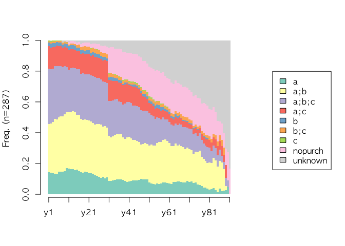

``` r
seqdplot(df.seq, border=NA, group=df.feat$sex) # 성별기준으로
```

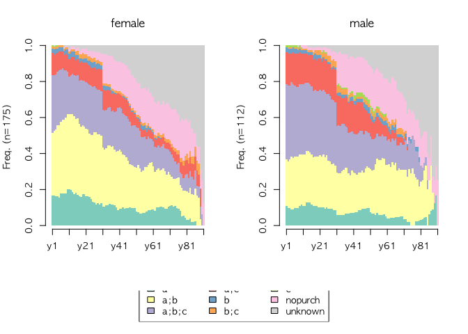

``` r
# 각 시퀀스별로 데이터 전체를 보고 싶으면
#seqstatd(df.seq)

# unknown을 아예 완전히 제거
df.seq <- seqdef(df.form, left='DEL', right='DEL', xtstep=10)
```

    ##  [>] found missing values ('NA') in sequence data

    ##  [>] preparing 287 sequences

    ##  [>] coding void elements with '%' and missing values with '*'

    ##  [>] 8 distinct states appear in the data:

    ##      1 = a

    ##      2 = a;b

    ##      3 = a;b;c

    ##      4 = a;c

    ##      5 = b

    ##      6 = b;c

    ##      7 = c

    ##      8 = nopurch

    ##  [>] state coding:

    ##        [alphabet]  [label]  [long label]

    ##      1  a           a        a

    ##      2  a;b         a;b      a;b

    ##      3  a;b;c       a;b;c    a;b;c

    ##      4  a;c         a;c      a;c

    ##      5  b           b        b

    ##      6  b;c         b;c      b;c

    ##      7  c           c        c

    ##      8  nopurch     nopurch  nopurch

    ##  [>] 287 sequences in the data set

    ##  [>] min/max sequence length: 1/91

``` r
# 빈도가 높은 10개 시퀀스
seqfplot(df.seq, border=NA, with.legend='right')
```

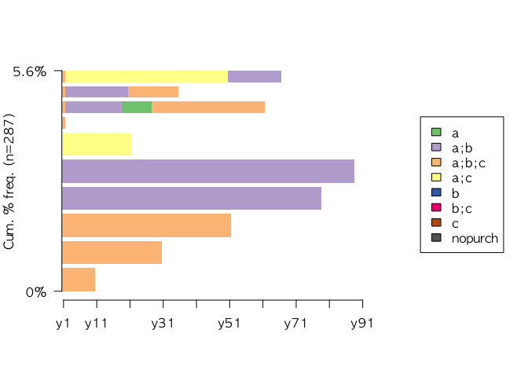

``` r
# 성별에 따라 빈도가 높은 10개 시퀀스
seqfplot(df.seq, group=df.feat$sex, border=NA)
```

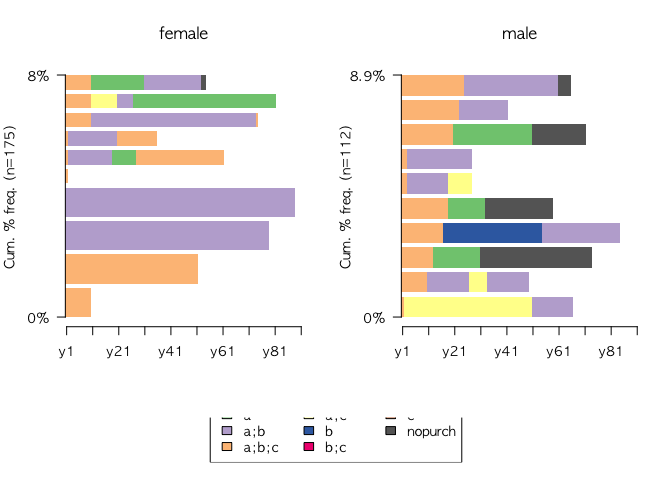

``` r
# 빈발 패턴
seqtab(df.seq[, 1:30]) # 1개월간 frequency table
```

    ##                 Freq Percent
    ## a;b;c/30          49    17.1
    ## a;b/30            45    15.7
    ## a;c/30            16     5.6
    ## a/30              11     3.8
    ## a;b;c/10           2     0.7
    ## a;b;c/22-a;b/8     2     0.7
    ## a;b/17-a;b;c/13    2     0.7
    ## a;b/27-a/3         2     0.7
    ## a;c/14-a;b;c/16    2     0.7
    ## a;c/21             2     0.7

``` r
# 각 패턴별 평균적으로 걸린 구매 기간
seqmtplot(df.seq, title='평균적으로 걸린 기간', with.legend='right')
```

    ##  [!] In rmarkdown::render() : title is deprecated, use main instead.

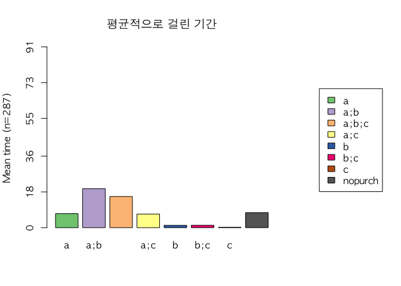

``` r
seqmtplot(df.seq, group=df.feat$sex, title='성별기준 평균적으로 걸린 기간')
```

    ##  [!] In rmarkdown::render() : title is deprecated, use main instead.

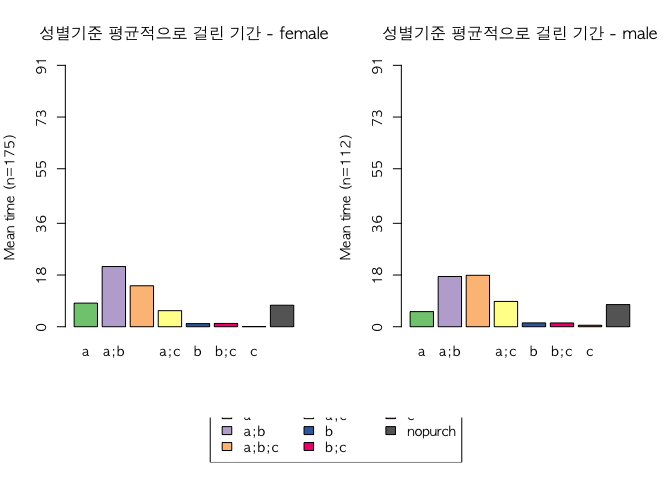

``` r
statd <- seqistatd(df.seq) ; apply(statd, 2, mean) # 숫자로 표현
```

    ##  [>] computing state distribution for 287 sequences ...

    ##          a        a;b      a;b;c        a;c          b        b;c 
    ##  7.0627178 19.6027875 15.6794425  6.8432056  1.1777003  1.2090592 
    ##          c    nopurch 
    ##  0.2160279  7.5714286

### 시퀀스 형태로 데이터 전환

``` r
df.evseq <- seqecreate(df.new, id = df.new$clientId, timestamp = df.new$orderdate, event = df.new$cart,
                       end.event = NULL, use.labels = FALSE, weighted= FALSE, tevent='state')
df.evseq <- seqecreate(df.seq, tevent='state')
head(df.evseq)
```

    ## [1] (a)-12-(a;b)-17-(a)-26-(a;b)-28-(%)-0
    ## [2] (a;b;c)-3-(a)-4-(nopurch)-78-(%)-0   
    ## [3] (a;b;c)-37-(%)-0                     
    ## [4] (a;b)-61-(a;b;c)-7-(%)-0             
    ## [5] (a;b)-72-(%)-0                       
    ## [6] (a;b)-79-(%)-0

``` r
# 순서 고려
```

``` r
# 순서가 빈발하는 패턴 찾기
df.subseq <- seqefsub(df.evseq, pmin.support=0.01)
rules <- TraMineR:::seqerules(df.subseq) 
head(rules)
```

    ##                  Rules Support      Conf      Lift Standardlift
    ## 1         (a;b) => (%)     192 0.9896907 0.9966359    0.9692877
    ## 2       (a;b;c) => (%)     182 1.0000000 1.0070175    1.0000000
    ## 3           (a) => (%)      95 0.9793814 0.9862543    0.9692855
    ## 4         (a;c) => (%)      93 1.0000000 1.0070175    1.0000000
    ## 5     (a;b;c) => (a;b)      78 0.4285714 0.6340206    0.2770226
    ## 6 (a;b;c) => (a;b)-(%)      78 0.4285714 0.6406250    0.2832102
    ##      JMeasure ImplicStat   p.value p.valueB1 p.valueB2
    ## 1 0.001013276  0.5573861 0.7113682         1         1
    ## 2         NaN -1.1261850 0.1300436         1         1
    ## 3 0.012711223  1.6104297 0.9463480         1         1
    ## 4         NaN -0.8050364 0.2103993         1         1
    ## 5 0.185911109  0.9146868 0.8198220         1         1
    ## 6 0.174777371  0.7416032 0.7708361         1         1

``` r
# 그래프로 표현
plot(df.subseq[1:10], col="cyan", ylab="Frequency", xlab="Subsequences", cex=1.5)
```

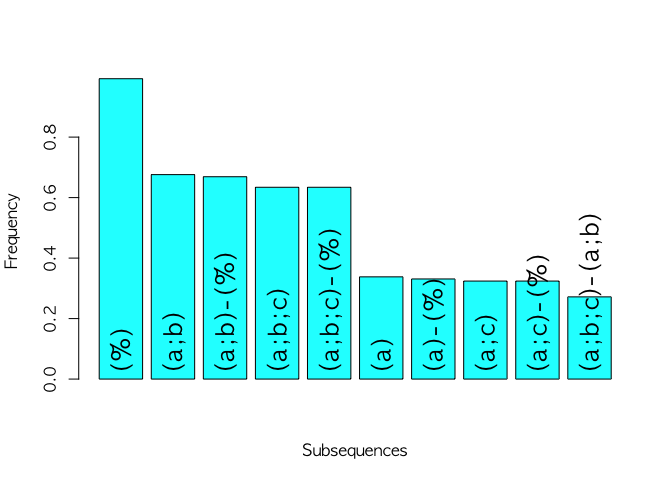

``` r
# 기간 제한을 두고 빈발 패턴 찾기
time.constraint <- seqeconstraint(max.gap=10, window.size=30) # 30일 윈도우
df.subseq.time.constr <- seqefsub(df.evseq, pmin.support=0.01, constraint=time.constraint) # 30일 기간내 빈발 패턴
plot(df.subseq.time.constr[1:10], col="cyan", ylab="Frequency", xlab="Subsequences", cex=1.5) # 그래프
```

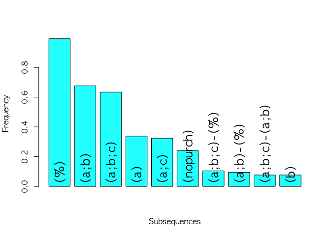

``` r
# 결과 줄어듬
```

``` r
# 성별을 기준으로 두고 빈발 패턴 찾기
discrseq <- seqecmpgroup(df.subseq, group=df.feat$sex)
head(discrseq)
```

    ##             Subsequence    Support    p.value statistic index Freq.female
    ## 1         (a;b)-(a)-(%) 0.09407666 0.01234331  6.260877    35  0.13142857
    ## 2             (a;b)-(a) 0.09756098 0.02688688  4.898060    34  0.13142857
    ## 3         (a;b)-(a;b;c) 0.19860627 0.04080315  4.184172    14  0.24000000
    ## 4     (a;b)-(a;b;c)-(%) 0.19860627 0.04080315  4.184172    15  0.24000000
    ## 5     (a;b)-(a;c)-(a;b) 0.03832753 0.04322222  4.086690    54  0.01714286
    ## 6 (a;b)-(a;c)-(a;b)-(%) 0.03832753 0.04322222  4.086690    55  0.01714286
    ##    Freq.male Resid.female Resid.male
    ## 1 0.03571429     1.610983  -2.013729
    ## 2 0.04464286     1.434384  -1.792980
    ## 3 0.13392857     1.228732  -1.535915
    ## 4 0.13392857     1.228732  -1.535915
    ## 5 0.07142857    -1.431480   1.789350
    ## 6 0.07142857    -1.431480   1.789350
    ## 
    ## Computed on 287 event sequences
    ##    Constraint Value
    ##  count.method  COBJ

``` r
plot(discrseq[1:10], cex=1.5) # 상위 10개 빈발 패턴
```

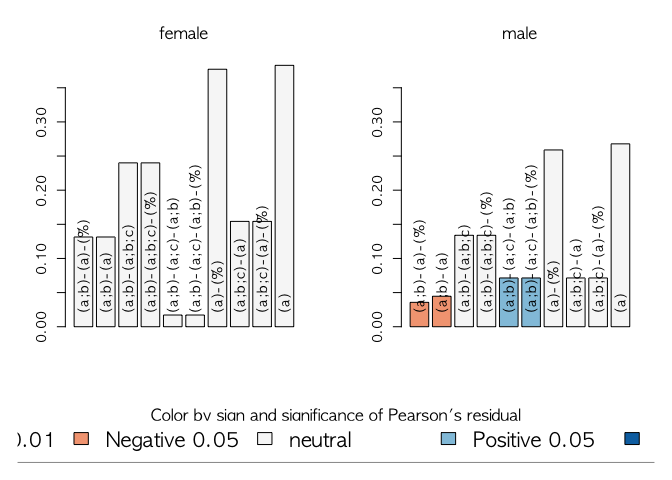

### Cluster로 묶어 보는 작업

``` r
library(cluster)
df.om <- seqdist(df.seq, method='OM', indel=1, sm='TRATE', with.missing=TRUE) # OM은 Optimal Matching distance 의 약자
```

    ##  [!] 'with.missing' set to FALSE as 'seqdata' doesn't contain missing values

    ##  [>] 287 sequences with 8 distinct states

    ##  [>] creating substitution-cost matrix using transition rates ...

    ##  [>] computing transition probabilities for states a/a;b/a;b;c/a;c/b/b;c/c/nopurch ...

    ##  [>] 281 distinct sequences

    ##  [>] min/max sequence length: 1/91

    ##  [>] computing distances using the OM metric

    ##  [>] elapsed time: 0.729 secs

``` r
clusterward <- agnes(df.om, diss=TRUE, method="ward") # Ward 버젼 Hierarchical cluster 생성
df.cl4 <- cutree(clusterward, k=4) # 4개 클러스터 형성
cl4.lab <- factor(df.cl4, labels=paste("Cluster", 1:4)) # 4개 클러스터를 팩터로 구분해서 고객마다 라벨을 붙임
seqrplot(df.seq, group=cl4.lab, dist.matrix=df.om, coverage=0.35, border=NA) #각 클러스터별 행동 패턴 그래프로
```

    ##  [>] number of objects (sum of weights): 148

    ##  [>] max. distance: 179.06

    ##  [>] neighborhood radius: 17.91

    ##  [>] 4 representative(s) selected, coverage=36% (threshold=35%)

    ##  [>] 145 distinct sequence(s)

    ##  [>] number of objects (sum of weights): 39

    ##  [>] max. distance: 179.06

    ##  [>] neighborhood radius: 17.91

    ##  [>] 2 representative(s) selected, coverage=49% (threshold=35%)

    ##  [>] 39 distinct sequence(s)

    ##  [>] number of objects (sum of weights): 66

    ##  [>] max. distance: 179.06

    ##  [>] neighborhood radius: 17.91

    ##  [>] 2 representative(s) selected, coverage=39% (threshold=35%)

    ##  [>] 64 distinct sequence(s)

    ##  [>] number of objects (sum of weights): 34

    ##  [>] max. distance: 179.06

    ##  [>] neighborhood radius: 17.91

    ##  [>] 2 representative(s) selected, coverage=35% (threshold=35%)

    ##  [>] 33 distinct sequence(s)

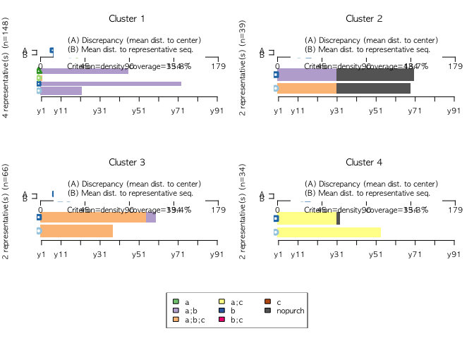

``` r
# 분포
seqdplot(df.seq, group=cl4.lab, border=NA)
```

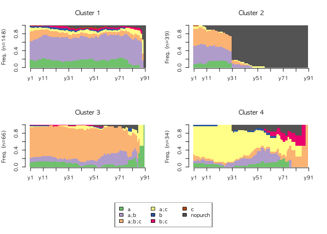

``` r
# 빈발도
seqfplot(df.seq, group=cl4.lab, pbarw=T, border=NA)
```

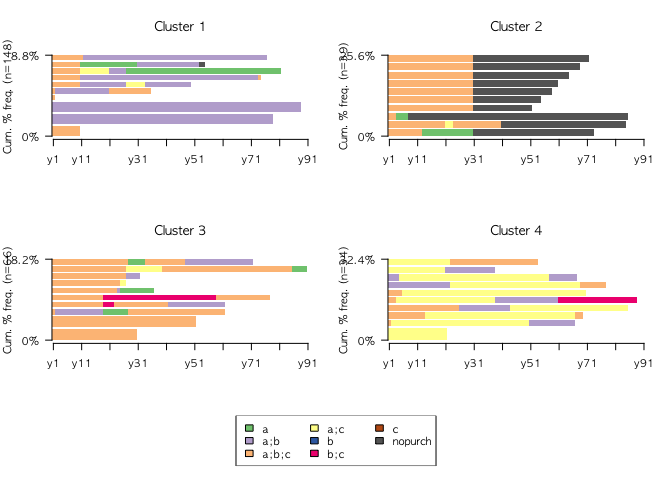

``` r
# 평균 구매주기
seqmtplot(df.seq, group=cl4.lab, border=NA)
```

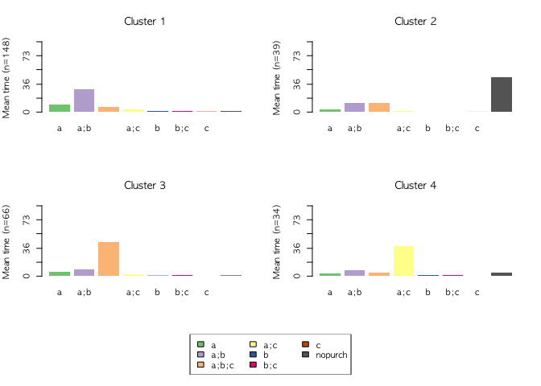
